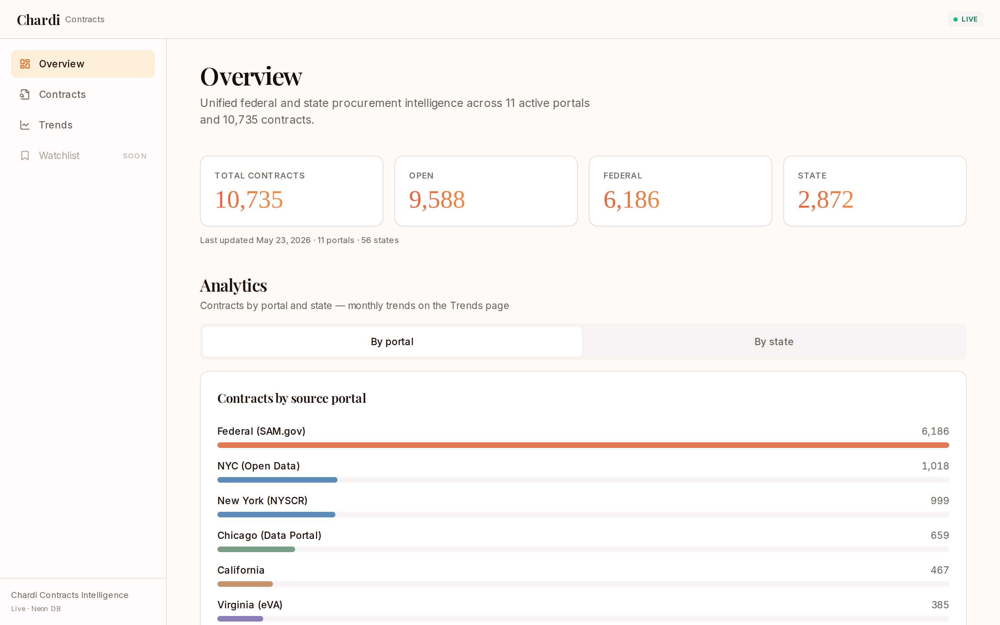
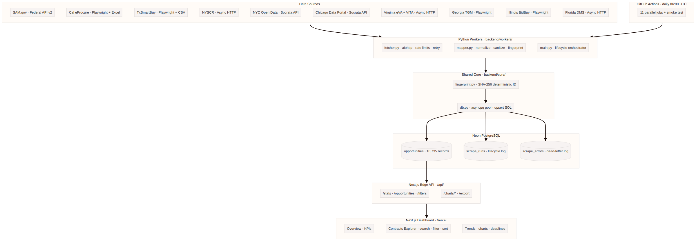
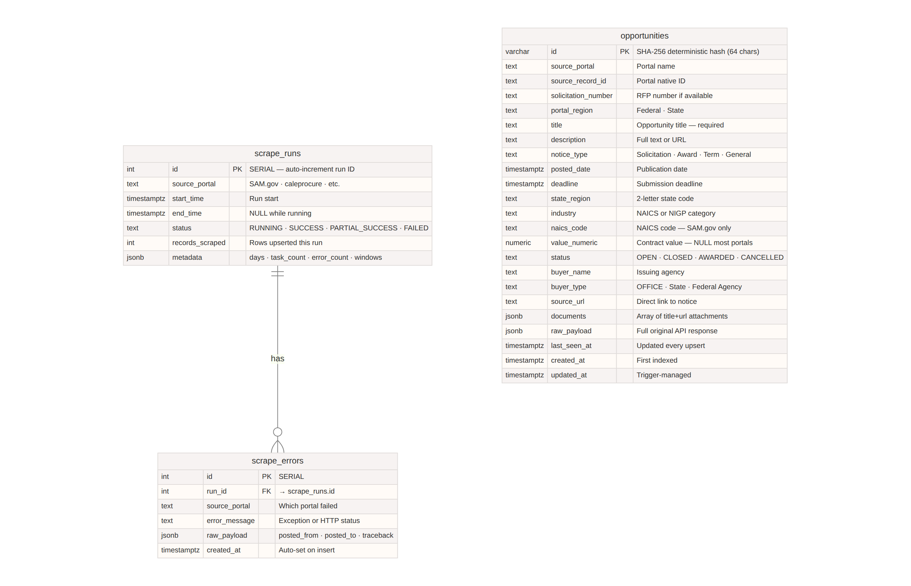
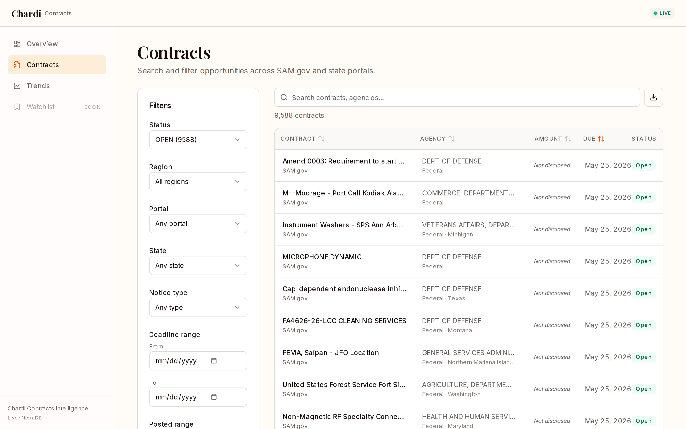
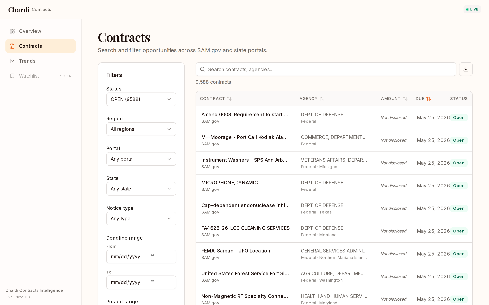
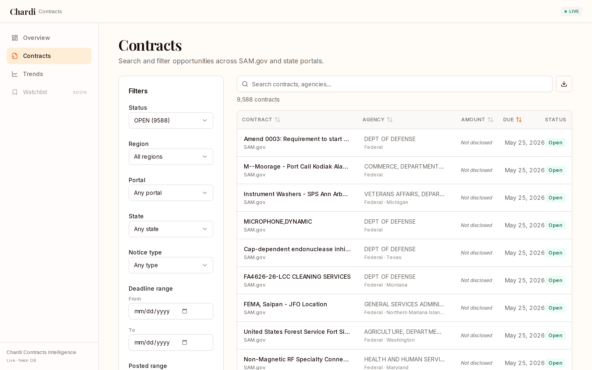
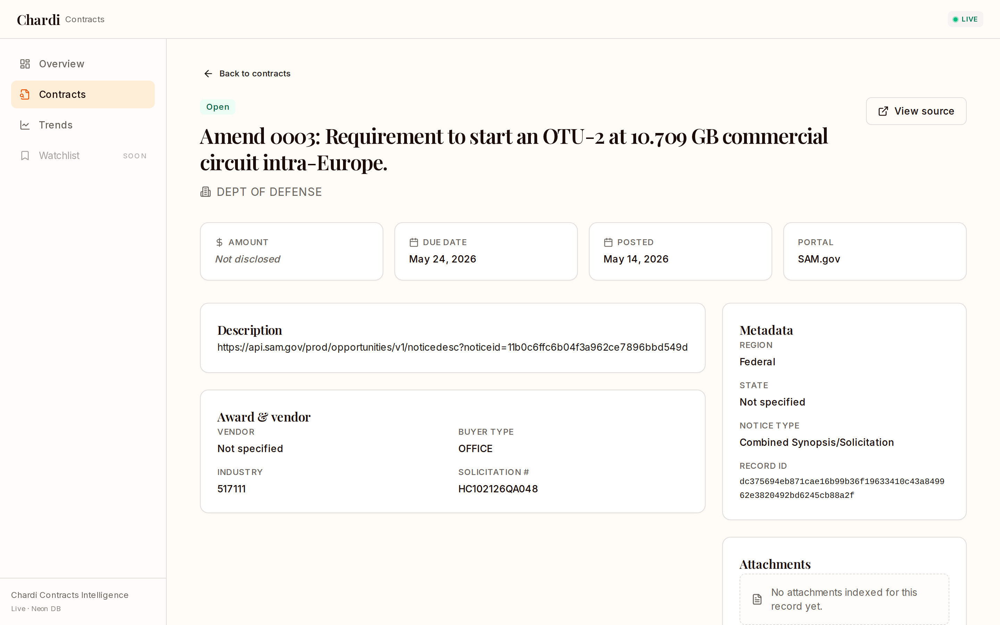
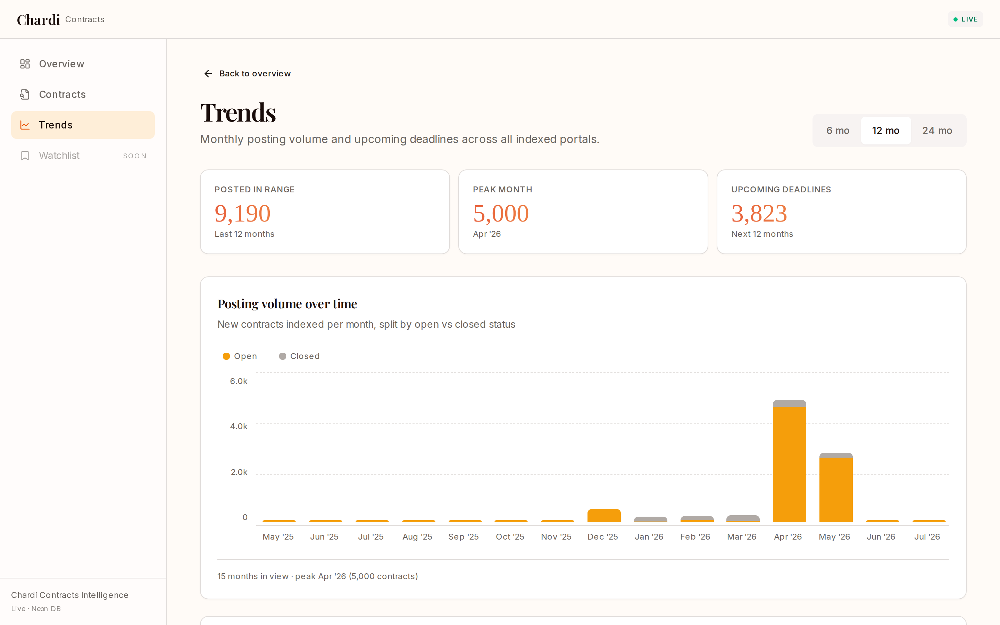
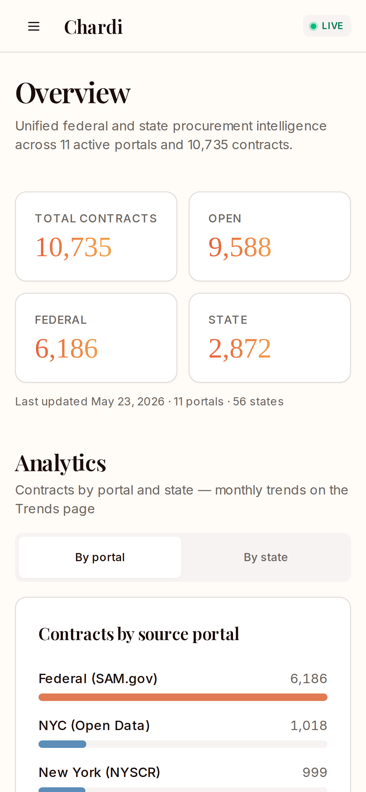
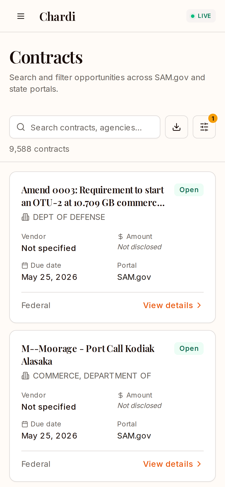

# Chardi Contracts

Government procurement intelligence across federal and state portals — normalized, deduplicated, and searchable in one place.

**Live** → [chardi-contracts.vercel.app](https://chardi-contracts.vercel.app)  
**Data** → 10,735 opportunities · 11 portals · 9,588 open · updated daily  
**Stack** → Python async workers · Next.js 14 · Neon PostgreSQL · GitHub Actions

---



---

## Coverage

| Portal | Records | Open | Region | Method |
|--------|---------|------|--------|--------|
| SAM.gov | 6,186 | 6,186 | Federal | REST API v2 |
| NYC Open Data | 1,018 | 0 | City — NY | Socrata API |
| New York (NYSCR) | 999 | 953 | State — NY | Async HTTP |
| Chicago Data Portal | 659 | 654 | City — IL | Socrata API |
| California (Cal eProcure) | 467 | 467 | State — CA | Playwright + Excel |
| Virginia (eVA) | 385 | 383 | State — VA | Async HTTP |
| Texas (TxSmartBuy) | 298 | 298 | State — TX | Playwright + CSV |
| Georgia (TGM) | 201 | 201 | State — GA | Playwright |
| Virginia (VITA) | 190 | 190 | State — VA | Async HTTP |
| Illinois (BidBuy) | 186 | 180 | State — IL | Playwright |
| Florida (DMS) | 146 | 76 | State — FL | Async HTTP |
| **Total** | **10,735** | **9,588** | | |

---

## Architecture

Each portal has a dedicated worker — `fetcher.py` handles network and rate limits, `mapper.py` normalizes to a canonical tuple, `main.py` orchestrates the run lifecycle. All workers share `core/db.py` for upserts and `core/fingerprint.py` for deterministic ID generation. GitHub Actions runs all 11 workers daily at 06:00 UTC.



### Database

Three tables. No joins required for dashboard queries.

`opportunities` — the unified contract record. One row per unique opportunity across all portals, identified by a SHA-256 deterministic primary key. Safe to upsert 100 times a day without duplicates.

`scrape_runs` — one row per worker execution. Tracks status (`RUNNING · SUCCESS · PARTIAL_SUCCESS · FAILED`), record counts, and a JSONB metadata column with per-window detail.

`scrape_errors` — dead-letter log. Every failed fetch or parse writes here with full traceback and context. Referenced by `run_id` back to `scrape_runs`.



---

## Product

### Contracts Explorer

Full-text search, filter by portal, state, status, and deadline range. Sortable table on desktop, card view on mobile.





### Filtered View — SAM.gov Federal



### Contract Detail



### Trends & Charts

Monthly posting volume, upcoming deadlines, breakdown by portal and state.



### Mobile

Designed mobile-first. Cards on small screens, table on desktop. Filter drawer, sticky header, thumb-friendly controls.





---

## Setup

### Prerequisites

- Python 3.12+
- Node.js 18+
- PostgreSQL (Neon recommended)
- SAM.gov API key — free at [api.sam.gov](https://api.sam.gov)

### Backend

```bash
python3 -m venv .venv
source .venv/bin/activate
pip install -r backend/requirements.txt

cp .env.example .env
# Add DATABASE_URL and SAM_GOV_API_KEY
```

Run a single worker:

```bash
python -m backend.workers.samgov.main --days 30
python -m backend.workers.california.main
python -m backend.workers.texas.main
python -m backend.workers.newyork.main
python -m backend.workers.virginia.main
python -m backend.workers.chicago.main
python -m backend.workers.georgia.main
python -m backend.workers.illinois.main
python -m backend.workers.florida.main
```

Verify:

```bash
python scripts/smoke_test.py
```

### Frontend

```bash
cd frontend
cp .env.local.example .env.local   # add DATABASE_URL
npm install
npm run dev
# http://localhost:3000
```

### Environment variables

| Variable | Required | Description |
|----------|----------|-------------|
| `DATABASE_URL` | Yes | Neon PostgreSQL connection string |
| `SAM_GOV_API_KEY` | Yes | SAM.gov public API key |
| `USER_AGENT` | No | Identifying header (default provided) |
| `REQUEST_TIMEOUT_SECONDS` | No | Read timeout — default 60 |

### Tests

```bash
python -m pytest backend/tests -q
# 7 passed
```

---

## API

All routes are Next.js Edge API routes deployed on Vercel.

| Route | Description |
|-------|-------------|
| `GET /api/stats` | KPI counts — total, open, federal, state, portals, states |
| `GET /api/opportunities` | Paginated list with filter + sort |
| `GET /api/opportunities/[id]` | Single record detail |
| `GET /api/filters` | Facet options — states, portals, statuses, buyer types |
| `GET /api/charts/by-portal` | Contract counts per portal |
| `GET /api/charts/by-state` | Contract counts per US state |
| `GET /api/charts/trend` | Monthly posting volume + upcoming deadlines |
| `GET /api/export?format=csv` | Filtered CSV download — up to 5,000 rows |
| `GET /api/export?format=json` | Filtered JSON download — up to 5,000 rows |

### Filter parameters

| Param | Type | Example |
|-------|------|---------|
| `q` | string | `cloud infrastructure` |
| `state` | string | `CA` |
| `status` | string | `OPEN` |
| `portal` | string | `SAM.gov` |
| `portal_region` | string | `Federal` · `State` |
| `deadline_from` | ISO date | `2026-06-01` |
| `deadline_to` | ISO date | `2026-06-30` |
| `sort` | string | `deadline` · `posted_date` · `title` · `buyer_name` |
| `order` | string | `asc` · `desc` |
| `page` | int | `1` |
| `limit` | int (max 100) | `20` |

---

## AI Leverage

This project was built using a deliberate multi-model workflow — each tool assigned to what it does best, outputs chained forward. The pattern is what engineers call a **Human-Orchestrated Heterogeneous AI Pipeline**: one person acting as the routing layer between specialized models, compressing decisions into artifacts before passing them downstream.

**Gemini Pro Extended — Architect**
Used as the primary architecture brain for the entire backend. Gemini designed the 3-table PostgreSQL schema, the SHA-256 deterministic fingerprint strategy for Change Data Capture, and the full SAM.gov ingestion spec. Key decisions it produced: the Smart 429 Interceptor (distinguishing temporary rate limits from hard daily quota lockouts), the Delta Sync strategy (`modifiedFrom` instead of `postedFrom` to capture updates to existing records), and the explicit `::timestamptz` / `::jsonb` SQL casting requirement that prevents asyncpg crashes. Gemini also produced the system prompt injected into Kiro's context and the `.cursorrules` file enforcing architectural constraints across all workers.

**Perplexity — Research & Prompt Engineering**
Used to validate architectural decisions quickly (confirmed asyncpg type strictness, SAM.gov quota limits, Socrata API patterns) and to produce the full frontend design specification — palette, typography hierarchy, mobile-first UX rules, component customization, and shadcn theming strategy. Also used to refine prompts before feeding them to Gemini, creating a validation loop that improved output quality.

**Cursor — Component Builder**
Used on the free tier to build each state/city scraper in isolation. Each scraper was prototyped, verified end-to-end, and documented as a `MASTER_PLAN.md` — a structured handoff artifact containing API discovery, architecture flowchart, optimization rationale, working code, and a QA checklist. Key discoveries: Chicago and NYC use Socrata's direct CSV export API (no Selenium needed, ~55s for 185k rows), Florida DMS returns all contracts in a single API call despite showing paginated UI, Illinois BidBuy requires JavaScript click automation via Selenium.

**Kiro — Integrator & Executor**
Received all plans and master plans and implemented the full integrated project: repository scaffold, all 11 workers adapted to the shared core, frontend dashboard, GitHub Actions cron, and test suite. Kiro also handled the debugging and human evaluation loop — fixing asyncpg type errors discovered in real runs, resolving PeopleSoft date validation traps, iterating on the 429 interceptor logic, and validating scraped data quality across portals.

The AI tools were multipliers. The architecture is sound because Gemini received precise constraints. The scrapers work because Cursor had focused, single-component scope. The integrated project exists because Kiro received complete specs. None of it shipped without a human making every routing decision and evaluating every output.

| Decision | Source | Impact |
|----------|--------|--------|
| SHA-256 deterministic IDs | Gemini | Solved CDC / deduplication permanently |
| `ON CONFLICT DO UPDATE` upsert | Gemini | Idempotent pipeline, safe to run daily |
| Explicit `::timestamptz` / `::jsonb` casts | Gemini | Prevented all asyncpg type crashes |
| Smart 429 Interceptor | Gemini | Prevented burning daily API quota on retries |
| Delta Sync — `modifiedFrom` | Gemini | Captures updates to old records, not just new |
| PAGE_LIMIT = 1000 | Gemini | 10x reduction in API calls per run |
| Playwright `expect_download()` in-memory | Gemini | No local file I/O, no blocking |
| Socrata CSV API — no Selenium | Cursor | 55s vs. minutes for Chicago / NYC |
| `__NEXT_DATA__` parsing for Florida | Cursor | Pure stdlib, no BeautifulSoup |
| Mobile-first card / table dual rendering | Perplexity | Demo-ready on phone |

---

## Repository structure

```
CHARDI/
├── backend/
│   ├── core/
│   │   ├── db.py              # asyncpg pool, upsert SQL, scrape_runs helpers
│   │   ├── fingerprint.py     # SHA-256 deterministic ID generation
│   │   └── settings.py        # Env-backed config
│   ├── workers/
│   │   ├── samgov/            # Federal — fetcher, mapper, main
│   │   ├── california/        # Playwright + Excel intercept
│   │   ├── texas/             # Playwright + CSV export
│   │   ├── newyork/           # Async HTTP scraper
│   │   ├── nyc_contract_awards/ # Socrata API
│   │   ├── chicago/           # Socrata API
│   │   ├── virginia/          # eVA (Playwright) + VITA (async HTTP)
│   │   ├── georgia/           # Playwright
│   │   ├── illinois/          # Playwright
│   │   └── florida/           # Async HTTP
│   ├── tests/                 # pytest — 7 passing
│   └── requirements.txt
├── frontend/
│   ├── app/
│   │   ├── (dashboard)/       # Overview · Contracts · Trends
│   │   └── api/               # 9 Edge API routes
│   ├── components/
│   └── lib/                   # Types, API client, DB client
├── .github/workflows/
│   └── daily-ingest-all.yml   # Daily cron — all 11 portals + smoke test
├── docs/                      # Architecture, schema, portal coverage, metrics
├── scripts/                   # Smoke test, runner scripts
└── .env.example
```

---

## Limitations

| Portal | Note |
|--------|------|
| Virginia eVA | Returns 403 to CI/cloud IPs — graceful skip, VITA still runs |
| Pennsylvania | Requires vendor registration — not accessible |
| Ohio | Requires vendor registration — not accessible |
| North Carolina | Requires vendor registration — not accessible |
| `value_numeric` | Not published by most portals — ~0% coverage |

---

## Documentation

| File | Contents |
|------|----------|
| [`docs/architecture.md`](docs/architecture.md) | System design, data flow, design principles |
| [`docs/schema.md`](docs/schema.md) | Full schema, upsert behavior, parameter order |
| [`docs/portal-coverage.md`](docs/portal-coverage.md) | Per-portal field mapping and coverage |
| [`docs/metrics-summary.md`](docs/metrics-summary.md) | Live data metrics |
| [`docs/ai-usage.md`](docs/ai-usage.md) | Full AI tool breakdown and key prompts |
| [`docs/demo-script.md`](docs/demo-script.md) | Demo walkthrough |
| [`KIRO_md/AI_USAGE_CONTEXT.md`](KIRO_md/AI_USAGE_CONTEXT.md) | Master AI collaboration documentation |
