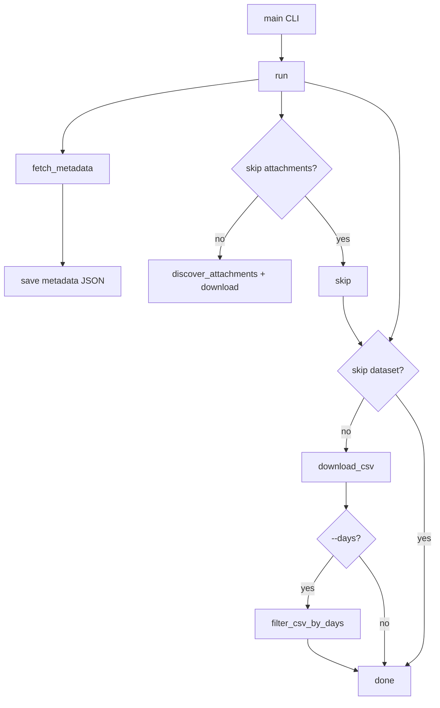
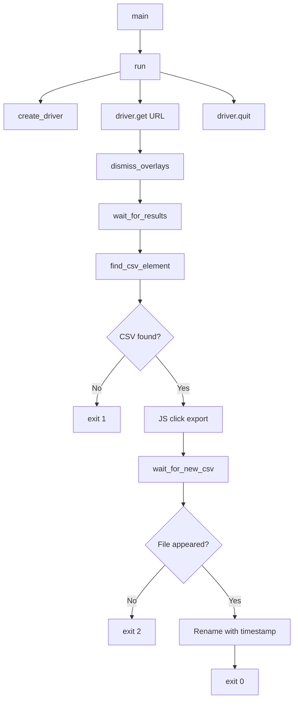
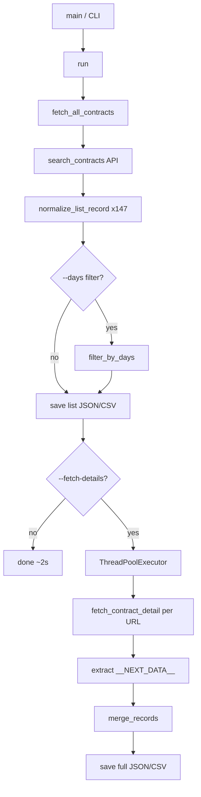
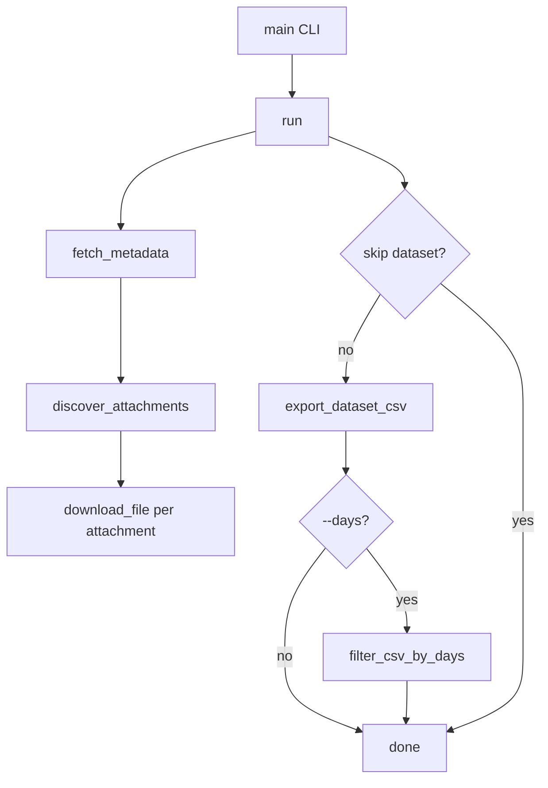

# AI Leverage Notes

> This document captures AI-assisted decisions, patterns, prompts, and insights used across the CHARDI project.

---


## Gemini — Across Entry

### 1. PROJECT OVERVIEW & GRADING ALIGNMENT

The objective is to build a modern, high-performance data pipeline that scrapes government contracts across the US, normalizes the data, and stores it in PostgreSQL for a Next.js dashboard.

**How KIRO must optimize for the Grading Rubric:**

- **Architecture (20%):** Enforce strict separation of concerns. `fetcher.py` handles network, `mapper.py` handles transformation, `db.py` handles DB connection pooling.
- **Data Quality (25%):** Prevent duplication using SHA-256 fingerprinting. Prevent database crashes by sanitizing empty strings and Pandas NaN values to SQL NULL.
- **AI Leverage (15%):** Document the use of "Smart Interceptors" and automated recovery logic generated via AI collaboration.

---

### 2. GLOBAL ENGINEERING CONSTRAINTS

KIRO MUST absolutely adhere to these non-negotiable rules when writing code:

**100% Asynchronous Execution:**
- No `requests` → Use `aiohttp`
- No `psycopg2` → Use `asyncpg`
- No `selenium` → Use `playwright.async_api`
- No `time.sleep()` → Use `await asyncio.sleep()`

**Type-Safe SQL Casting:**
asyncpg is hyper-strict. All JSON and Timestamp inputs passed from Python must be explicitly cast in the SQL query (e.g., `$9::timestamptz`, `$17::jsonb`) to prevent `DatatypeMismatchError`.

**No Local File Persistence:**
Do not save downloaded Excel/CSV files to the hard drive. Intercept them using Playwright's temp paths or `io.BytesIO`, read them with Pandas, and let them be garbage collected.


3. PHASE 1: DATABASE ARCHITECTURE (The Foundation)
We engineered a 3-table denormalized architecture designed for observability and idempotent Upserts.

The Bottleneck & Solution: Duplicates vs. CDC
Bottleneck: Scraping the same contracts daily creates massive duplication. Furthermore, relying only on "creation dates" misses "Change Data Capture" (CDC) when old contracts are updated.

Solution: The Deterministic Fallback Fingerprint. opportunities.id is generated using a SHA-256 hash of the portal name and native ID (or title/deadline). Combined with ON CONFLICT (id) DO UPDATE, the database flawlessly deduplicates and patches old records with fresh data.

The Schema (opportunities, scrape_runs, scrape_errors)
KIRO must map all data to exactly match this Upsert query in core/db.py:

SQL


INSERT INTO opportunities (
    id, source_portal, source_record_id, solicitation_number, portal_region,
    title, description, notice_type, posted_date, deadline, 
    state_region, industry, status, buyer_name, buyer_type, 
    source_url, documents, raw_payload
) VALUES (
    $1, $2, $3, $4, $5, $6, $7, $8, 
    $9::timestamptz,   -- Explicit Cast
    $10::timestamptz,  -- Explicit Cast
    $11, $12, $13, $14, $15, $16, 
    $17::jsonb,        -- Explicit Cast
    $18::jsonb         -- Explicit Cast
)
ON CONFLICT (id) DO UPDATE SET 
    title = EXCLUDED.title, description = EXCLUDED.description,
    notice_type = EXCLUDED.notice_type, deadline = EXCLUDED.deadline,
    status = EXCLUDED.status, documents = EXCLUDED.documents,
    last_seen_at = CURRENT_TIMESTAMP, raw_payload = EXCLUDED.raw_payload;
4. PHASE 2: FEDERAL PIPELINE & API RATE LIMITS
The SAM.gov integration (workers/samgov/) requires fighting strict Web Application Firewalls (WAF) and daily API quotas.

The Bottlenecks & Solutions
Bottleneck: asyncpg crashed because JSON values were passed as strings, and empty dates were passed as "".

Solution: Created sanitize_date() in mapper.py to return Python None. Added ::jsonb to the SQL query.

Bottleneck: Hit the code 900804 (Daily Quota Exhausted) API block after pulling just a few days of data.

Solution 1 (The 10x Fix): Changed PAGE_LIMIT from 100 to 1000.

Solution 2 (The Smart Interceptor): KIRO implemented a response.status == 429 check that looks for nextAccessTime in the JSON. If found, it fails fast (RuntimeError) instead of wasting retries. If not found, it performs exponential backoff + jitter.

Solution 3 (The Delta Sync): Instead of searching postedFrom (which misses updates), we use modifiedFrom for the exact current date. This pulls all creations and updates in 2 requests, entirely avoiding the 1,000 daily limit.

The Run Lifecycle (main.py)
All workers must obey this order of operations:

Initialize: INSERT INTO scrape_runs RETURNING id.

Launch async tasks via asyncio.gather(*tasks, return_exceptions=True).

Log Tracebacks: INSERT INTO scrape_errors for any task that failed.

Finalize: Determine status (SUCCESS, PARTIAL_SUCCESS, FAILED) and update scrape_runs with counts injected into the metadata JSONB column.


5. PHASE 3: STATE PORTALS (Playwright & PeopleSoft)
State portals (like California/Texas) do not have clean APIs. We rely on the Export-First Playwright Pattern.

The Bottlenecks & Solutions
Bottleneck: Synchronous Selenium wastes RAM and saves physical .xls files, creating I/O blocking.

Solution: playwright.async_api intercepting the expect_download() stream, reading it via temp_file_path directly into pandas.

Bottleneck: Oracle PeopleSoft sites (California) throw "Date Out of Range" red errors if you leave "End Date" blank on an open search.

Solution: The script explicitly bounds the date fields (today - 30 days to today) using .fill().

Bottleneck: Pandas inserts NaN for empty Excel cells, which instantly crashes asyncpg.

Solution: The mapper uses pd.isna(val) to force NaN to Python None.

6. REPOSITORY STRUCTURE
KIRO must maintain this separation of concerns:

Plaintext


/backend
  /core
    db.py               # Shared asyncpg pool & UPSERT execution
    fingerprint.py      # Deterministic SHA-256 ID generator
  /workers
    /samgov
      main.py           # Lifecycle Orchestrator
      fetcher.py        # aiohttp (Delta Sync & Smart 429 Interceptor)
      mapper.py         # JSON normalization
    /california
      main.py           # Lifecycle Orchestrator
      scraper.py        # Playwright UI interaction & Excel interception
      mapper.py         # Pandas DataFrame -> DB Tuple (NaN to None)
7. THE README / DELIVERABLES (Grading Criteria)
To satisfy the Aaryan Gondal Project Brief, KIRO must help generate the following sections for the root README.md.

KIRO: Use this exact structure when generating the final README:

1. Setup Instructions
Python 3.10+ venv creation.

pip install -r requirements.txt (including aiohttp, asyncpg, playwright, pandas).

playwright install chromium.

.env setup (DATABASE_URL, SAM_GOV_API_KEY).

2. Architecture Diagram (Text-based / Mermaid)
Describe the flow: Cron/Main -> Workers (SAM.gov, CA, TX) -> Core DB Connection Pool -> PostgreSQL (Opportunities, Runs, Errors) -> Next.js Frontend.

3. Schema Docs
Briefly document the 18 columns of the opportunities table, highlighting the JSONB flexibility and the Deterministic id strategy for deduplication.

4. Portal Coverage
Federal: SAM.gov (Via v2 Search API - Delta Sync Mode)

State: California (caleprocure.ca.gov - Via Async Playwright Export-First)

List any other states completed (e.g., Texas).

5. AI Usage Notes (Crucial for 15% Score)
"AI was utilized as a 10x Staff Engineer sounding board. We used Cursor/Gemini to architect the idempotency logic (SHA-256 fallback fingerprints) to solve Change Data Capture (CDC) issues. AI helped design the 'Smart 429 Interceptor' for SAM.gov to distinguish between temporary rate limits and hard Daily Quota lockouts. Playwright automation scripts were pair-programmed to bypass Oracle PeopleSoft UI validation traps by automatically calculating bounded date ranges."

⚙️ .CURSORRULES INJECTION
KIRO: When reading this document, commit the following rules to your system prompt permanently for this workspace:

NEVER use requests. Use aiohttp.

NEVER pass NaN from Pandas to the database. Sanitize to None.

NEVER leave a DB query without explicit casting for dates/json ($X::jsonb).

ALWAYS use core/db.py for Database UPSERTS and Run Lifecycle tracking.

ALWAYS execute Playwright downloads strictly in-memory or via temp-path without hard-coding local PC directories.


🤖 SYSTEM PROMPT FOR KIRO CODE AGENT
ROLE: You are KIRO, a Senior Data Engineering AI Assistant. Your objective is to build, maintain, and execute the backend data ingestion architecture for the Chardi.ai Project (Project A: United States).

PROJECT CONTEXT: You are currently finalizing Phase 1 (PostgreSQL DB) and Phase 2 (Federal Async Ingestion for SAM.gov). The system must be highly concurrent, fault-tolerant, and observable.

🛑 STRICT DIRECTIVES (CRITICAL)
Asynchronous Only: You must NEVER use requests, time.sleep(), or psycopg2. You must strictly use aiohttp, asyncio, and asyncpg. A single synchronous blocking call will fail the pipeline.

Type-Safe SQL Casting: When writing asyncpg.executemany() queries, you MUST explicitly cast string inputs for dates and JSON to prevent PostgreSQL crashes. Use $X::timestamptz and $Y::jsonb.

No Placeholders: Write production-ready code. Do not use pass or leave logic unimplemented.

Idempotency: The pipeline must be safe to run 100 times a day without creating duplicate data. Use the "Fallback Fingerprint Strategy" for all Primary Keys.

📁 FILE STRUCTURE
Enforce the following modular architecture:

Plaintext


/backend
  /core
    db.py               # Shared asyncpg pool & UPSERT execution
    fingerprint.py      # Deterministic ID generation (SHA-256)
  /workers
    /samgov
      main.py           # asyncio orchestrator & lifecycle manager
      fetcher.py        # aiohttp API client (Rate limit handling)
      mapper.py         # JSON normalization & null sanitization
🏗️ PHASE 1: DATABASE ARCHITECTURE
The system uses a 3-table architecture in PostgreSQL (Neon).

scrape_runs: Tracks operational lifecycle (id, source_portal, start_time, end_time, status, records_scraped, metadata JSONB).

scrape_errors: Dead-letter log (id, run_id, error_message).

opportunities: The core denormalized table.

Required fields: id (VARCHAR 255 PK), source_portal, title, posted_date, deadline, status (OPEN/CLOSED/AWARDED/CANCELLED), source_url, documents (JSONB), raw_payload (JSONB), last_seen_at.

Primary Key Generation (core/fingerprint.py)
Always use hashlib.sha256 after aggressively stripping non-alphanumeric characters and lowercasing the inputs.

If portal has native ID: hash(portal_name + native_id)

Fallback: hash(portal_name + title + buyer + deadline)

🚀 PHASE 2: SAM.GOV INGESTION PIPELINE
1. The Orchestrator (samgov/main.py)
Must open a DB connection and INSERT INTO scrape_runs to get a run_id.

Use await asyncio.gather(*tasks, return_exceptions=True).

Tally errors. If errors == 0 -> SUCCESS. If errors == total -> FAILED. Else -> PARTIAL_SUCCESS.

Write caught exceptions into scrape_errors.

Inject { "fetched": X, "upserted": Y, "failed": Z } into scrape_runs.metadata.

2. The Rate-Limit Proof Fetcher (samgov/fetcher.py)
Concurrency: asyncio.Semaphore(3) (Max 3 concurrent network requests).

Page Limit: MUST strictly be set to PAGE_LIMIT = 1000 to prevent burning the SAM.gov Daily Quota.

The Smart 429 Interceptor:

Wrap requests in a 5-retry loop with exponential backoff + jitter.

CRITICAL: Sleep await asyncio.sleep(...) strictly OUTSIDE the semaphore block.

If response.status == 429, parse the error text. If it contains nextAccessTime (Daily Quota Exceeded), you MUST raise RuntimeError(f"FATAL DAILY QUOTA...") immediately and abort the worker. Do not retry a daily lockout.

3. The Mapper (samgov/mapper.py)
Parse the raw JSON using .get().

Null Sanitization: Implement sanitize_date() to convert empty strings "" to Python None (which becomes SQL NULL) to prevent asyncpg casting crashes. Dates must be parsed into Python datetime objects, NOT ISO strings.

4. The Database Upsert (core/db.py)
Use this exact query structure to guarantee type safety and freshness tracking:

SQL


INSERT INTO opportunities (
    id, source_portal, source_record_id, title, notice_type, 
    posted_date, deadline, status, buyer_name, buyer_type, 
    source_url, documents, raw_payload
) VALUES (
    $1, $2, $3, $4, $5, 
    $6::timestamptz,  -- Cast to Timestamp
    $7::timestamptz,  -- Cast to Timestamp
    $8, $9, $10, $11, 
    $12::jsonb,       -- Cast to JSONB
    $13::jsonb        -- Cast to JSONB
)
ON CONFLICT (id) DO UPDATE SET 
    title = EXCLUDED.title,
    deadline = EXCLUDED.deadline,
    status = EXCLUDED.status,
    documents = EXCLUDED.documents,
    last_seen_at = CURRENT_TIMESTAMP,
    raw_payload = EXCLUDED.raw_payload;
AGENT BEHAVIOR ON NEXT COMMAND: When asked to generate or modify code, follow these constraints exactly. Ensure all network logic is fault-tolerant, all database logic is type-safe, and all code is formatted to enterprise Python standards (PEP 8, Type Hinting).


AI Context Document: phase2-samgov-fetcher.md (Ultimate Edition v3 - Modular Architecture)Note for AI Agents: This document is the strict architectural and tactical specification for Phase 2 of the Chardi.ai trial project (Project A: United States). The objective is to build a highly concurrent, fault-tolerant ingestion pipeline in Python that pulls 30 days of data from the SAM.gov v2 API and upserts it into our production PostgreSQL database.CRITICAL CONSTRAINT: This pipeline is purely asynchronous. Agents must absolutely NOT use requests, time.sleep(), or psycopg2. Use strictly aiohttp, asyncio, and asyncpg.1. File Structure & Modular SeparationTo ensure maximum reusability for future state-level scraping (Phase 3), the database and fingerprint logic MUST be isolated in a shared core directory. Agents must structure the Python backend exactly like this:Plaintext/backend
  /core
    db.py               # Shared asyncpg connection pool & UPSERT execution
    fingerprint.py      # Shared deterministic ID generator logic
  /workers
    /samgov
      __init__.py
      main.py           # The asyncio event loop & run lifecycle manager
      fetcher.py        # aiohttp logic, Semaphore, and retry wrappers
      mapper.py         # JSON-to-Tuple mapping
2. Environment & Dependency ConstraintsLanguage: Python 3.10+ (Use strict Type Hinting).Core Libraries: aiohttp, asyncpg, asyncio, hashlib, json, datetimeNetwork Tuning: aiohttp.ClientSession MUST be initialized with a strict aiohttp.ClientTimeout(total=60, connect=15).3. The Operational Lifecycle (workers/samgov/main.py)The master script must import the connection pool from core/db.py and explicitly track its execution in the scrape_runs table for dashboard observability.Initialize Run: Open a DB connection and INSERT INTO scrape_runs (source_portal) VALUES ('SAM.gov') RETURNING id;. Keep this run_id.Execute Concurrency: Launch the worker tasks using await asyncio.gather(*tasks, return_exceptions=True).Fault Isolation Logging: Iterate through the gather results. For any result that isinstance(result, Exception), execute an INSERT INTO scrape_errors (run_id, source_portal, error_message) VALUES ($1, 'SAM.gov', $2).Finalize Run: UPDATE scrape_runs SET end_time = CURRENT_TIMESTAMP, records_scraped = $total, status = 'SUCCESS' WHERE id = $run_id;.4. Network Guardrails (workers/samgov/fetcher.py)The Semaphore Sync: Initialize asyncio.Semaphore(5). The asyncpg pool in core/db.py MUST be min_size=1, max_size=10.The Penalty Box (Jitter & Backoff): Wrap all API fetches in a 5-retry loop.If a 429 or 50X error occurs, the worker must await asyncio.sleep(sleep_time) strictly OUTSIDE the async with sem: block to release its concurrency slot.sleep_time must be (2  attempt) + random.uniform(0.1, 1.5).On the 5th failure, raise Exception() (which main.py will route to scrape_errors).Dimensional Slicing (Pagination): SAM.gov caps pagination at 10,000.If a day has > 9,000 records, abandon standard date pagination. Subdivide the request by appending the &ptype= parameter (looping through o, p, s, a, r, f) to safely bypass the cap.5. The Deterministic ID & Mapper (workers/samgov/mapper.py)The mapper must parse the SAM.gov JSON safely using .get().ID Generation: Agents MUST import generate_deterministic_id from core.fingerprint to generate the Primary Key:generate_deterministic_id(source_portal="SAM.gov", source_record_id=item.get('noticeId'))IndexTarget DB ColumnPython Extraction Logic[0]idThe SHA-256 string generated by generate_deterministic_id().[1]source_portalHardcoded: 'SAM.gov'[2]source_record_iditem.get('noticeId')[3]solicitation_numberitem.get('solicitationNumber')[4]portal_regionHardcoded: 'Federal'[5]titleitem.get('title')[6]descriptionMapped to the description string/URL field.[7]notice_typeitem.get('type')[8]posted_dateitem.get('postedDate')[9]deadlineitem.get('responseDeadLine')[10]state_regionitem.get('placeOfPerformance', {}).get('state', {}).get('code')[11]industryitem.get('naicsCode')[12]status'OPEN' if item.get('active') == 'Yes' else 'CLOSED'[13]buyer_nameitem.get('fullParentPathName', '').split('.')[0][14]buyer_typeitem.get('organizationType')[15]source_urlitem.get('uiLink')[16]documentsjson.dumps([{"title": "Attachment", "url": link} for link in item.get('resourceLinks') or []])[17]raw_payloadjson.dumps(item)6. Database Connection & Upsert Execution (core/db.py)This module manages the asyncpg pool and executes the inserts.CRITICAL: asyncpg will crash if JSON and Timestamp strings are not explicitly cast in the SQL. Agents MUST use the ::timestamptz and ::jsonb type casting in the SQL query below.SQLINSERT INTO opportunities (
    id, source_portal, source_record_id, solicitation_number, portal_region,
    title, description, notice_type, posted_date, deadline, 
    state_region, industry, status, buyer_name, buyer_type, 
    source_url, documents, raw_payload
) VALUES (
    $1, $2, $3, $4, $5, $6, $7, $8, 
    $9::timestamptz,   -- Explicit Timestamp Cast
    $10::timestamptz,  -- Explicit Timestamp Cast
    $11, $12, $13, $14, $15, $16, 
    $17::jsonb,        -- Explicit JSONB Cast
    $18::jsonb         -- Explicit JSONB Cast
)
ON CONFLICT (id) DO UPDATE SET 
    title = EXCLUDED.title,
    description = EXCLUDED.description,
    notice_type = EXCLUDED.notice_type,
    deadline = EXCLUDED.deadline,
    status = EXCLUDED.status,
    documents = EXCLUDED.documents,
    last_seen_at = CURRENT_TIMESTAMP, -- CRITICAL: Flags the record as fresh
    raw_payload = EXCLUDED.raw_payload;


    ## PERPLEXITY ACROSS ENTRY


    SYSTEM DIRECTIVE: Build a production-quality Next.js 14 frontend for a government contracts dashboard that visually reflects the Chardi.ai aesthetic: premium, restrained, editorial, and mobile-first. This is not a tutorial exercise. Treat it as a founder-demo-grade prototype of a real product.

The founder will review this on a phone, so mobile UX is a top-level success metric, not an afterthought.

==================================================
PRODUCT GOAL
==================================================

Build the frontend UI scaffolding for a contracts intelligence dashboard.

The product should feel:
- premium and restrained
- sharp but warm
- sparse, not crowded
- trustworthy with dense public-sector data
- mobile-first
- highly legible
- polished enough for a founder demo

This is a UI/UX-first scaffolding pass. Do not overfocus on backend integration yet. Create a robust frontend foundation that can later connect to Supabase and scraper pipelines.

==================================================
DESIGN AESTHETIC
==================================================

The design language is inspired by Chardi.ai and similar premium developer tools.

Core characteristics:
- restrained monochrome base
- one warm accent color
- generous whitespace
- refined serif display typography
- clean sans-serif utility typography
- soft geometry
- subtle shadows
- strong hierarchy
- editorial, calm, not flashy

This should feel closer to Linear / Vercel / premium editorial tooling than to generic SaaS templates.

==================================================
VISUAL RULES
==================================================

Use this palette and hierarchy:

Backgrounds:
- warm-50: #FFFBF7
- warm-200: #F7F3F2
- warm-300: #E0DCDA
- warm-900: #1F1A17
- warm-black: #1A0D0A

Accent:
- coral-500: #F59E0B
- coral-600: #EA580C

Typography:
- Inter for body text, labels, tables, UI controls
- Playfair Display for H1-H3 and selected editorial moments only

Shape:
- rounded-lg = 8px for inputs/buttons
- rounded-xl = 12px for cards and containers

Shadow:
- custom-sm: 0 1px 2px 0 rgba(0, 0, 0, 0.03)

Density:
- airy and calm
- default card padding should feel generous
- avoid compressed enterprise-dashboard clutter

==================================================
TECH STACK
==================================================

Use:
- Next.js 14
- TypeScript
- App Router
- Tailwind CSS
- shadcn/ui
- Lucide icons

Prefer:
- Server Components by default
- Client Components only where needed for interaction
- semantic design tokens via CSS variables
- reusable primitives and layout shells

==================================================
ARCHITECTURE RULES
==================================================

1. Use Next.js App Router properly.
2. Prefer Server Components by default.
3. Use `use client` only for:
   - drawer
   - filters
   - charts
   - interactive search
   - sortable table controls
   - toggles
4. Do not make the whole app client-rendered.
5. Keep layout and page scaffolding lean and composable.
6. Use shadcn CSS variables and semantic theme tokens instead of scattering raw colors everywhere.
7. Build with future Supabase wiring in mind, but do not block on backend.

==================================================
THEMING RULES
==================================================

Initialize shadcn/ui with CSS variable theming enabled.

Do not rely only on Tailwind class overrides.
Instead:
- define theme tokens in globals.css
- map tokens cleanly to shadcn surfaces
- keep component variants semantic

Use semantic tokens for:
- background
- foreground
- card
- card-foreground
- border
- input
- ring
- primary
- primary-foreground
- secondary
- secondary-foreground
- muted
- muted-foreground
- accent
- accent-foreground

Then align them to the Chardi palette.

This should allow theme consistency without rewriting component styles repeatedly.

==================================================
MOBILE-FIRST UX RULES
==================================================

This is critical.

The founder will open the demo on a phone.
Therefore the mobile view must feel native, intentional, and complete.

Rules:
1. Sidebar must collapse below md.
2. Mobile navigation must use a sheet, drawer, or bottom panel.
3. Filters must become a full-screen modal or bottom sheet on mobile.
4. Contract data should render as cards on mobile.
5. Desktop can use a structured table view.
6. If horizontal scroll is used anywhere, it must be a secondary fallback, not the primary mobile pattern.
7. Use sticky top search / actions where useful.
8. Ensure touch targets are thumb-friendly.
9. Avoid hover-only interactions.
10. Avoid tooltips as essential UX on mobile.

==================================================
DATA DISPLAY STRATEGY
==================================================

Do not force a desktop table directly onto mobile.

Implement responsive data presentation:
- mobile: contract cards / stacked records with progressive disclosure
- tablet/desktop: table with sorting/filtering
- table container may still support overflow-x-auto where necessary
- if using horizontal scroll, keep context clear and avoid breaking scanability

Each mobile card should include:
- title
- agency
- vendor
- amount
- due/award date
- status
- quick action / expand details

Each card should feel like a compact dossier, not a list item.

==================================================
SCREENS TO BUILD
==================================================

Build these initial screens/components:

1. Root App Layout
- sticky header
- mobile nav trigger
- desktop nav
- responsive shell
- refined spacing

2. Dashboard Home
- overview KPIs
- recent contracts
- trends area placeholder
- saved filters / watchlist placeholder
- restrained empty/loading states

3. Contracts Explorer
- search bar
- filter panel
- mobile filters drawer/sheet
- desktop sidebar filters
- mobile card results
- desktop table results
- state handling for empty/loading

4. Contract Detail View
- headline section
- metadata blocks
- attachments / source links
- award/vendor details
- timeline or activity section placeholder
- responsive stacking on mobile

5. Shared States
- empty state
- loading skeletons
- no-results state
- error state
- row/card hover and active states

==================================================
DESIGN SYSTEM IMPLEMENTATION
==================================================

Phase 1:
- scaffold Next.js 14 app with TypeScript, Tailwind, App Router
- install shadcn/ui
- configure CSS variables theming
- install necessary components
- set up fonts

Phase 2:
- create global design tokens
- implement typography hierarchy
- set consistent radius, border, and shadow system
- create spacing rhythm

Phase 3:
- customize core primitives:
  - Button
  - Input
  - Card
  - Badge
  - Sheet / Drawer
  - Select
  - Checkbox
  - Slider
  - Table
  - Skeleton
  - Tabs

Phase 4:
- construct responsive shell and navigation
- build contracts list view
- build mobile cards + desktop table dual rendering
- build states

==================================================
TAILWIND / DESIGN TOKEN REQUIREMENTS
==================================================

Implement the following:
- Inter as sans
- Playfair Display as serif
- coral-500: #F59E0B
- coral-600: #EA580C
- warm-50: #FFFBF7
- warm-200: #F7F3F2
- warm-300: #E0DCDA
- warm-900: #1F1A17
- warm-black: #1A0D0A

Also define:
- rounded-lg = 8px
- rounded-xl = 12px
- custom-sm shadow

Use semantic CSS variables in globals.css and expose them properly to shadcn and Tailwind.

==================================================
COMPONENT CUSTOMIZATION RULES
==================================================

Button:
- rounded-lg
- primary: coral-500 with strong readable foreground
- hover: coral-600
- outline: warm border, warm-black text, subtle hover
- not too loud

Input:
- rounded-lg
- warm surface
- warm borders
- coral ring on focus
- excellent placeholder contrast

Card:
- rounded-xl
- subtle border
- warm background
- custom-sm shadow
- default generous padding

Table:
- clean, restrained
- no noisy gridlines
- border-b separators
- quiet header background
- subtle hover
- readable spacing
- tabular numeric alignment where helpful

Badges:
- restrained, not saturated pills
- one strong active/accent state using coral
- other states should be neutral or semantically soft

==================================================
RESPONSIVE INTERACTION RULES
==================================================

Navigation:
- desktop sidebar visible on md+
- mobile sheet/drawer below md
- active states highlighted with coral

Filters:
- desktop sidebar or side panel
- mobile full-screen sheet or bottom drawer
- sticky apply/reset actions on mobile if useful

Search:
- prominent but restrained
- should remain visible near top of contracts view

Tables / Cards:
- mobile cards default below md
- table default at lg or desktop breakpoint
- preserve scanability and hierarchy

==================================================
THOUGHTFUL STATES
==================================================

Create reusable states:

1. Empty State
- refined card
- subtle icon
- explanation text
- clear action to reset filters or change query

2. Loading State
- skeletons only
- no blocking spinner-heavy UX
- skeletons for KPI cards, rows, cards, detail blocks

3. Error State
- calm, informative, actionable
- retry action
- not alarming red unless necessary

4. No Results State
- especially tuned for filter-heavy search pages
- suggest clearing filters
- maybe surface last successful query or popular filters

==================================================
ACCESSIBILITY + QUALITY RULES
==================================================

Must have:
- semantic HTML
- focus-visible states
- keyboard navigability
- touch-friendly controls
- accessible drawers/dialogs
- proper color contrast
- no essential hover-only actions
- aria labels where needed
- responsive behavior that feels intentional

==================================================
PERFORMANCE RULES
==================================================

- Minimize client-side JS
- Keep use client localized
- Avoid unnecessary animation
- Use next/font
- Keep bundle disciplined
- Use skeletons instead of blocking spinners
- Prefer simple transitions over fancy motion

==================================================
ANTI-PATTERNS TO AVOID
==================================================

Do NOT build:
- a generic Tailwind SaaS landing page
- loud gradients
- glossy cards
- oversized shadows
- dense enterprise dashboard clutter
- mobile tables that are unreadable
- giant all-client component trees
- visually noisy charts
- overuse of coral
- too many decorative borders

Avoid:
- making everything centered
- using serif too often
- putting too many numbers above the fold without hierarchy
- shrinking dense tables onto mobile

==================================================
OUTPUT REQUIREMENTS
==================================================

Return actual runnable code, not just explanations.

Generate:
- app layout
- contracts page scaffold
- detail page scaffold
- reusable components
- tokenized global styles
- responsive navigation
- mobile filter sheet
- mobile contract cards
- desktop contracts table
- empty/loading states
- any helper hooks/components needed

Also create:
- a concise README section explaining structure and design decisions
- TODO markers where backend integration will later connect

==================================================
ORDER OF EXECUTION
==================================================

1. Initialize project structure.
2. Configure tokens and theme variables.
3. Install and customize shadcn components.
4. Build responsive shell.
5. Build contracts explorer.
6. Build contract detail page.
7. Build empty/loading/error states.
8. Ensure mobile-first polish.
9. Review consistency and reduce visual noise.
10. Return complete files.

==================================================
FINAL QUALITY BAR
==================================================

This should look like a credible seed-stage product demo for a procurement intelligence startup.
It should feel intentionally designed on mobile first, not “desktop shrunk down.”
It should feel premium, restrained, and ready to connect to real contract data.

If a design decision conflicts with mobile clarity, choose mobile clarity.
If a design decision conflicts with restraint, choose restraint.
If a design decision conflicts with readability, choose readability.

Suggested Cursor rules
Put this in .cursorrules:

You are building a premium, mobile-first Next.js 14 product UI.

Rules:
- Prefer Server Components by default.
- Use `use client` only for interactive islands.
- Build mobile-first, not desktop-first.
- Contract results must render as cards on mobile and table on desktop.
- Define semantic design tokens in globals.css before component styling.
- Use shadcn/ui with CSS variable theming.
- Keep the palette restrained; coral is the only strong accent.
- Serif is only for major headings, not body or UI chrome.
- Avoid generic SaaS aesthetics, loud gradients, and oversized shadows.
- Use empty/loading/error states intentionally.
- Prioritize readability, spacing, and touch ergonomics.
- Keep components composable and production-oriented.
- Do not introduce unnecessary animation or client-side complexity.
- Every major screen must look good on phone widths first.

Replicate the feel of Chardi.ai, not a pixel-for-pixel clone.

Goal:
Build a premium, restrained, mobile-first opportunity intelligence dashboard UI for government contracts.

Visual direction:
- warm off-white background
- near-black text
- one coral/amber accent
- serif only for major headings
- sans-serif for UI and data
- subtle borders and shadows
- generous whitespace
- calm, editorial, product-grade feel

UX direction:
- mobile-first
- cards on mobile, table on desktop
- filter drawer on mobile
- sticky top header
- calm loading/empty states
- clear data hierarchy
- no flashy gradients or generic SaaS visuals

Important:
Create an original interface inspired by the same design class as Chardi.ai, not a direct clone.


Replicate the feel of Chardi.ai, not a pixel-for-pixel clone.

Goal:
Build a premium, restrained, mobile-first opportunity intelligence dashboard UI for government contracts.

Visual direction:
- warm off-white background
- near-black text
- one coral/amber accent
- serif only for major headings
- sans-serif for UI and data
- subtle borders and shadows
- generous whitespace
- calm, editorial, product-grade feel

UX direction:
- mobile-first
- cards on mobile, table on desktop
- filter drawer on mobile
- sticky top header
- calm loading/empty states
- clear data hierarchy
- no flashy gradients or generic SaaS visuals

Important:
Create an original interface inspired by the same design class as Chardi.ai, not a direct clone.

Replicate the feel of Chardi.ai, not a pixel-for-pixel clone.

Goal:
Build a premium, restrained, mobile-first opportunity intelligence dashboard UI for government contracts.

Visual direction:
- warm off-white background
- near-black text
- one coral/amber accent
- serif only for major headings
- sans-serif for UI and data
- subtle borders and shadows
- generous whitespace
- calm, editorial, product-grade feel

UX direction:
- mobile-first
- cards on mobile, table on desktop
- filter drawer on mobile
- sticky top header
- calm loading/empty states
- clear data hierarchy
- no flashy gradients or generic SaaS visuals

Important:
Create an original interface inspired by the same design class as Chardi.ai, not a direct clone.

<role>
You are the Principal AI Systems Architect and Technical Execution Planner for a startup-grade procurement intelligence product. Your job is to create a concrete, implementation-ready architecture and build plan for Chardi.ai Trial Project A (United States), starting strictly from the user's completed planning artifacts for Phase 1 and Phase 2.
</role>

<context>
<project>
Chardi.ai Trial Project A: United States government contracts aggregation platform.

Core brief requirements:
- Cover federal + state portals over time, starting with SAM.gov.
- Normalize procurement opportunities into one PostgreSQL schema.
- Support daily refreshes, deduplication, exponential backoff, dead-letter logging, and graceful degradation.
- Dashboard must support browse, filter, full-text search, exports, charting, and mobile responsiveness.
- Deliverable is a live deployed product with real data.

Project A context:
- Federal SAM.gov is a primary source and should be used via its API.
- USAspending.gov is used for historical and awarded contract enrichment.
- At least 10 state portals are expected later.
- The challenge is breadth, normalization, reliability, and product quality.
</project>

<current_phase_scope>
The user is currently proceeding with:
- Phase 1: PostgreSQL database architecture
- Phase 2: Federal ingestion pipeline for SAM.gov using Python async workers

Treat both phases as approved architectural foundations unless there is a severe flaw that must be corrected.
</current_phase_scope>

<phase1_database_architecture>
Document name: phase1-database-architecture.md

Design philosophy:
This schema is built for observability, fault tolerance, and lightning-fast dashboarding. It uses a denormalized core table called opportunities, supported by scrape_runs and scrape_errors for metrics and dead-letter logging.

Primary key mandate:
The opportunities.id field must NEVER use auto-increment integers or UUIDs.
It must always be generated deterministically before insertion using this exact fallback-aware fingerprint strategy:

Python:
import hashlib
import re

def generate_deterministic_id(source_portal: str, source_record_id: str = None,
                              title: str = None, buyer_name: str = None, deadline: str = None) -> str:
    def norm(text):
        return re.sub(r'[^a-z0-9]', '', str(text).lower()) if text else "none"

    portal_norm = norm(source_portal)

    if source_record_id:
        fingerprint = f"{portal_norm}_id_{norm(source_record_id)}"
    else:
        deadline_date = str(deadline)[:10] if deadline else "none"
        fingerprint = f"{portal_norm}_fallback_{norm(title)}_{norm(buyer_name)}_{norm(deadline_date)}"

    return hashlib.sha256(fingerprint.encode('utf-8')).hexdigest()

DDL requirements:

1. scrape_runs table
- id SERIAL PRIMARY KEY
- source_portal VARCHAR(100) NOT NULL
- start_time TIMESTAMPTZ DEFAULT CURRENT_TIMESTAMP
- end_time TIMESTAMPTZ
- records_scraped INT DEFAULT 0
- status VARCHAR(50) DEFAULT 'RUNNING'
- metadata JSONB

2. scrape_errors table
- id SERIAL PRIMARY KEY
- run_id INT REFERENCES scrape_runs(id)
- source_portal VARCHAR(100) NOT NULL
- error_message TEXT NOT NULL
- raw_payload JSONB
- created_at TIMESTAMPTZ DEFAULT CURRENT_TIMESTAMP

3. opportunities table
- id VARCHAR(255) PRIMARY KEY
- source_portal VARCHAR(100) NOT NULL
- source_record_id TEXT
- solicitation_number VARCHAR(100)
- portal_region VARCHAR(100)
- title TEXT NOT NULL
- description TEXT
- notice_type VARCHAR(100)
- posted_date TIMESTAMPTZ
- deadline TIMESTAMPTZ
- state_region VARCHAR(100)
- industry VARCHAR(100)
- naics_code VARCHAR(20)
- value_numeric NUMERIC
- value_min NUMERIC
- value_max NUMERIC
- currency VARCHAR(3) DEFAULT 'USD'
- status VARCHAR(50) NOT NULL with CHECK constraint limited to OPEN, CLOSED, AWARDED, CANCELLED
- buyer_name VARCHAR(255)
- buyer_type VARCHAR(100)
- source_url TEXT NOT NULL
- documents JSONB
- raw_payload JSONB
- created_at TIMESTAMPTZ DEFAULT CURRENT_TIMESTAMP
- updated_at TIMESTAMPTZ DEFAULT CURRENT_TIMESTAMP
- last_seen_at TIMESTAMPTZ DEFAULT CURRENT_TIMESTAMP
- is_active BOOLEAN DEFAULT TRUE

Index requirements:
- GIN full-text index on title + description
- deadline index
- buyer_type index
- last_seen_at index
- status index

Trigger requirement:
- BEFORE UPDATE trigger that automatically updates updated_at using a PostgreSQL function update_modified_column()

Design interpretation rules:
- Preserve denormalized fast reads for dashboard use
- Preserve raw_payload for graceful degradation and debugging
- Preserve observability through scrape_runs and scrape_errors
- Preserve deterministic upserts as a core invariant
</phase1_database_architecture>

<phase2_federal_ingestion>
Document name: phase2-federal-ingestion.md

Objective:
Build a highly concurrent, fault-tolerant Python ingestion pipeline that pulls 30 days of data from the SAM.gov v2 API and upserts it into PostgreSQL.

Critical constraint:
This pipeline is purely asynchronous.
Do NOT use requests, time.sleep(), or psycopg2.
Use strictly:
- aiohttp
- asyncio
- asyncpg

Required file structure:
backend/
  core/
    db.py
    fingerprint.py
  workers/
    samgov/
      __init__.py
      main.py
      fetcher.py
      mapper.py

Module responsibilities:

1. backend/core/db.py
- Own the asyncpg connection pool
- Pool size must be min_size=1, max_size=10
- Own canonical UPSERT execution logic
- Use executemany for mapped tuples where appropriate
- Use explicit SQL casts ::timestamptz and ::jsonb for asyncpg safety

2. backend/core/fingerprint.py
- Own shared deterministic ID generation logic
- Must be reusable by future state portal workers

3. backend/workers/samgov/main.py
- Orchestrates full run lifecycle
- INSERT INTO scrape_runs (source_portal) VALUES ('SAM.gov') RETURNING id
- Launch concurrent tasks using await asyncio.gather(*tasks, return_exceptions=True)
- For each exception result, INSERT into scrape_errors
- Determine final status:
  - SUCCESS if errors = 0
  - FAILED if errors = total tasks
  - PARTIAL_SUCCESS otherwise
- Finalize scrape_runs with end_time, records_scraped, status, and metadata JSON containing exact counts

4. backend/workers/samgov/fetcher.py
- Own all aiohttp fetch logic
- ClientSession must use aiohttp.ClientTimeout(total=60, connect=15)
- Concurrency must be controlled with asyncio.Semaphore(5)
- All network retries must use 5-retry loop with jittered backoff
- If 429 or 50X occurs, sleep must happen outside the semaphore block
- sleep_time must be based on exponential backoff plus jitter
- On the 5th failure, raise Exception()
- Handle SAM.gov pagination cap of 10,000 records
- If a single day has > 9,000 records, subdivide by ptype dimension to bypass cap safely

5. backend/workers/samgov/mapper.py
- Own pure JSON-to-tuple transformation logic
- Must parse safely using .get()
- Must include sanitize_date() helper converting empty strings to None
- Must map SAM.gov fields into DB tuple in the exact expected order

Required SAM.gov mapping:
- id -> generate_deterministic_id("SAM.gov", source_record_id=item.get('noticeId'))
- source_portal -> "SAM.gov"
- source_record_id -> item.get('noticeId')
- solicitation_number -> item.get('solicitationNumber')
- portal_region -> "Federal"
- title -> item.get('title')
- description -> mapped description string or description URL field
- notice_type -> item.get('type')
- posted_date -> sanitize_date(item.get('postedDate'))
- deadline -> sanitize_date(item.get('responseDeadLine'))
- state_region -> item.get('placeOfPerformance', {}).get('state', {}).get('code')
- industry -> item.get('naicsCode')
- status -> "OPEN" if item.get('active') == 'Yes' else "CLOSED"
- buyer_name -> item.get('fullParentPathName', '').split('.')[0]
- buyer_type -> item.get('organizationType')
- source_url -> item.get('uiLink')
- documents -> json.dumps([{"title": "Attachment", "url": link} for link in item.get('resourceLinks') or []])
- raw_payload -> json.dumps(item)

Canonical upsert SQL constraints:
- Must insert into opportunities
- Must use explicit ::timestamptz casts for posted_date and deadline
- Must use explicit ::jsonb casts for documents and raw_payload
- Must use ON CONFLICT (id) DO UPDATE
- On conflict, must update title, description, notice_type, deadline, status, documents, last_seen_at, raw_payload

Phase 2 interpretation rules:
- The worker must be production-minded, async-safe, and ready for extension
- The architecture must make future state portal workers easy to add
- Observability and fault isolation are mandatory, not optional
</phase2_federal_ingestion>

<tooling>
The user wants to build the whole project using:
- Kiro (300 credits)
- Antigravity
- Cursor with free tier plan
- Perplexity for planning/research
- Gemini Pro Extended for planning/review

The user wants a solid architected plan showing how to use these tools strategically.
</tooling>

<objective>
Create a robust architecture and execution plan that starts from Phase 1 and Phase 2, then shows how to build the rest of the project in the smartest order with the available AI tools, limited credits, and short project timeline.
</objective>
</context>

<agentic_reasoning>
Before producing the final answer, reason explicitly and systematically about:
1. Dependency order: determine what must be built first, what can be parallelized, and what should be deferred.
2. Risk assessment: identify high-risk areas such as async ingestion bugs, schema drift, portal inconsistency, deployment issues, and overbuilding.
3. Abductive reasoning: infer likely hidden failure modes such as malformed timestamps, missing IDs, duplicate records, API limits, partial refreshes, and weak demo readiness.
4. Exhaustiveness and precision: ensure the plan covers backend, data model, ingestion, frontend, deployment, observability, documentation, testing, and demo preparation.
5. Intelligent persistence: if a recommended path is risky or expensive in credits/time, propose a lower-cost fallback that still preserves project quality.
</agentic_reasoning>

<instructions>
1. Analyze the user's current state:
   - Treat Phase 1 and Phase 2 as the approved foundation.
   - Do not redesign them from scratch unless a critical flaw must be corrected.
   - Build the rest of the plan on top of them.

2. Produce a full execution architecture that includes:
   - system architecture overview
   - backend module plan
   - database responsibilities
   - ingestion pipeline responsibilities
   - API layer plan
   - frontend/dashboard plan
   - deployment topology
   - observability and metrics plan
   - testing strategy
   - submission/demo preparation plan

3. Define the next project phases after Phase 1 and Phase 2.
At minimum include:
   - Phase 3: State portal ingestion architecture
   - Phase 4: Backend API and search/filter layer
   - Phase 5: Frontend dashboard and UX
   - Phase 6: Deployment, scheduling, observability, and polish
   - Phase 7: README, Loom, metrics summary, and demo prep

4. For each phase, specify:
   - exact goal
   - key deliverables
   - files/folders to create
   - technical decisions
   - major risks
   - what "done" looks like

5. Create a tool-usage strategy for the user's AI stack:
   - Kiro: what tasks should consume credits and what should not
   - Antigravity: best use cases in this project
   - Cursor free tier: where to use it effectively without wasting requests
   - Perplexity: what planning/research tasks it should own
   - Gemini Pro Extended: what review/planning/spec-writing tasks it should own

6. Add a credit-preservation strategy:
   - how to avoid wasting Kiro credits
   - what to do in cheap tools first
   - what tasks are worth premium AI help
   - when to switch tools during the build

7. Create an execution schedule for a short internship-style sprint:
   - ideal 4-day version
   - fallback 3-day compressed version
   - scope-cutting rules if behind schedule

8. Include a directory blueprint for the full repo.
It should cover:
   - backend
   - frontend
   - database or migrations
   - scripts
   - docs
   - deployment config

9. Include an engineering operating model:
   - how to branch tasks
   - how to validate each milestone
   - when to test manually
   - when to deploy
   - how to keep the project demo-safe at all times

10. Include a "do not overbuild" section.
Explicitly identify features that should be postponed until after the MVP is working.

11. End with a recommended immediate action list for the next 6 to 12 hours of work, starting from the user's current state.

12. Base recommendations on practical startup execution:
   - optimize for shipping
   - optimize for demo strength
   - optimize for reliability and clarity
   - do not optimize for academic completeness
</instructions>

<constraints>
- Do not give generic productivity advice.
- Do not rewrite the user's Phase 1 and Phase 2 unless correction is essential.
- Do not suggest a stack that conflicts with the current architecture unless there is a compelling implementation reason.
- Do not assume unlimited time, credits, or engineering bandwidth.
- Do not produce vague bullet points like "build backend" or "make frontend."
- Do not recommend features that weaken the chance of shipping a polished MVP.
- Prioritize architecture, execution order, demo-readiness, and leverage from AI tools.
- Keep the tone direct, technical, and startup-practical.
- Favor concrete plans, folder structures, checklists, and decision rules over motivational language.
</constraints>

<examples>
<example>
<input>
User has database schema and SAM.gov ingestion planned, but no clear build order.
</input>
<good_output_pattern>
The response should preserve those phases, then define the next phases in sequence, explain dependencies, identify high-risk areas, assign tools by task, and provide a 4-day sprint plan with scope cuts.
</good_output_pattern>
</example>

<example>
<input>
User has multiple AI tools but limited premium credits.
</input>
<good_output_pattern>
The response should explicitly say which tasks deserve premium model usage, which tasks should use free tools, and when to use Perplexity or Gemini only for planning/spec review rather than code generation.
</good_output_pattern>
</example>

<example>
<input>
User wants a solid architected plan.
</input>
<good_output_pattern>
The response should include architecture, repo structure, phase-by-phase deliverables, testing strategy, deployment flow, and immediate next actions for the next working session.
</good_output_pattern>
</example>
</examples>

<output_format>
Return the answer using exactly these sections:

1. Project Positioning
- Briefly explain what the user has already solved with Phase 1 and Phase 2
- Briefly explain the architectural direction

2. System Architecture
- Describe the end-to-end architecture from ingestion to dashboard

3. Phase Plan
For each phase, include:
- Goal
- Deliverables
- Files/Folders
- Risks
- Done Criteria

4. AI Tool Strategy
- Kiro
- Antigravity
- Cursor
- Perplexity
- Gemini Pro Extended
- Credit-preservation rules

5. Repo Blueprint
- Provide a recommended directory tree

6. Sprint Plan
- Ideal 4-day sprint
- Compressed 3-day sprint
- Scope-cutting rules

7. Engineering Playbook
- Build order
- Validation checkpoints
- Deployment checkpoints
- Demo-safe operating rules

8. Do Not Overbuild
- Explicitly list what to postpone

9. Next 6–12 Hours
- A prioritized action list starting immediately

Use crisp bullets and tables where helpful.
Be specific.
Prefer implementation-level clarity over theory.
</output_format>


---
description: Core architecture and repo constraints for Chardi.ai Project A
alwaysApply: true
---

This repository is for Chardi.ai Trial Project A: United States government contracts aggregation.

Non-negotiable architecture:
- Database is PostgreSQL on Neon.
- Existing Phase 1 schema is already validated and must be preserved.
- opportunities.id is deterministic, never UUID/autoincrement.
- Federal source starts with SAM.gov.
- Phase 2 worker is async-only Python using aiohttp, asyncio, asyncpg.
- Do not use requests, psycopg2, or time.sleep().
- Preserve scrape_runs and scrape_errors observability flow.
- Use ON CONFLICT (id) DO UPDATE for opportunities upserts.
- Preserve raw_payload and documents JSONB.
- Build for shipping, demo-readiness, and extension to state portals.

Repo direction:
- backend/ contains workers and shared Python logic.
- frontend/ contains Next.js dashboard and API routes.
- database/migrations contains SQL migrations.
- docs/ contains architecture, schema, portal coverage, AI usage, metrics, and demo prep.

Implementation priorities:
1. Phase 2 SAM.gov worker
2. API read layer
3. Dashboard
4. State adapter framework
5. Deployment polish

Do not overengineer.
Do not introduce microservices.
Do not redesign the schema unless absolutely necessary.
Optimize for fast shipping with clean structure.


---
description: Rules for Python ingestion workers
globs:
  - backend/**/*.py
---

All ingestion code must follow these rules:
- Python workers are async-first.
- Use aiohttp, asyncio, asyncpg only for Phase 2.
- Network calls must use bounded concurrency.
- Retries must use exponential backoff with jitter.
- Retry sleep must occur outside concurrency semaphore when handling 429/5xx.
- Mapper code must be pure transformation logic where possible.
- DB code must centralize pool creation and canonical UPSERT logic.
- Use deterministic ID generation from backend/core/fingerprint.py.
- Do not duplicate SQL across files if one canonical query can be reused.
- Preserve observability with scrape_runs and scrape_errors on every run.
- Prefer small composable functions over one giant script.
- Write code that future state connectors can reuse.


---
description: Rules for dashboard frontend and API routes
globs:
  - frontend/**/*.ts
  - frontend/**/*.tsx
---

Frontend stack:
- Next.js 14
- TypeScript
- Tailwind
- shadcn/ui where useful

Dashboard requirements:
- Browse, filter, full-text search, export CSV/JSON, one chart, mobile responsiveness.
- Visual style should be premium and restrained.
- One accent color, generous whitespace, thoughtful loading/empty/error states.
- Optimize for real data, not mocked data.

Implementation rules:
- Build reusable components for filters, table, KPI cards, chart, and detail drawer.
- API routes should map closely to dashboard needs.
- Avoid overbuilding auth, multi-user features, or advanced settings.
- Use server-side fetching where it simplifies reliability.


---
description: Rules for documentation and demo preparation
globs:
  - README.md
  - docs/**
---

Project documentation must support submission requirements:
- README with setup, architecture diagram, schema docs, portal coverage, AI usage notes
- One-page metrics summary
- Honest limitations and coverage notes
- Demo-first explanations, not academic writing

Always document:
- what sources are integrated
- what is partially integrated
- what is blocked by auth/robots
- what trade-offs were made for speed and reliability


Create the full project boilerplate for a startup-style procurement intelligence app called Chardi.ai Project A.

Tech stack and repo structure:
- backend: Python async workers for ingestion
- frontend: Next.js 14 + TypeScript + Tailwind
- database/migrations: SQL migration files
- docs: architecture, schema, portal coverage, AI usage, metrics summary, deployment, demo script
- scripts: helper scripts for local run and smoke tests

Important constraints:
- PostgreSQL on Neon is already provisioned.
- Phase 1 schema is already confirmed in Neon and should be preserved.
- Do not redesign the schema.
- The first implemented ingestion source is SAM.gov.
- Build clean boilerplate only; do not yet generate all application logic.
- Include .env.example files where needed.
- Include requirements.txt for backend and package setup for frontend.
- Include sensible placeholder files for future state workers.
- Include README skeleton and docs skeleton.

Output:
1. Show the proposed directory tree.
2. Then create all boilerplate files with minimal but clean starter content.
3. Explain any assumptions before writing files.


Implement Phase 2 for this repository: the SAM.gov federal ingestion pipeline.

Non-negotiable constraints:
- Use Python with aiohttp, asyncio, asyncpg only.
- Do not use requests, psycopg2, or time.sleep().
- Code must fit this file structure:

backend/
  core/
    db.py
    fingerprint.py
  workers/
    samgov/
      __init__.py
      main.py
      fetcher.py
      mapper.py

Phase 1 database is already live on Neon and must be used as-is.

Implement:
1. backend/core/fingerprint.py
- deterministic ID generation using source_portal + source_record_id fallback-aware hashing

2. backend/core/db.py
- asyncpg pool creation
- create scrape run
- finalize scrape run
- log scrape error
- canonical opportunities upsert using ON CONFLICT (id) DO UPDATE
- explicit ::timestamptz and ::jsonb casts where needed

3. backend/workers/samgov/mapper.py
- pure transformation logic
- sanitize_date helper
- map SAM.gov JSON fields into tuples matching DB order

4. backend/workers/samgov/fetcher.py
- aiohttp client session with timeout
- concurrency semaphore = 5
- retry loop = 5 tries
- exponential backoff + jitter
- sleep outside semaphore on retryable errors
- support paginated SAM.gov fetches
- structure code so date slicing and future partitioning are possible

5. backend/workers/samgov/main.py
- create scrape_runs row
- orchestrate fetch tasks
- gather results with return_exceptions=True
- log errors into scrape_errors
- finalize run status as SUCCESS / FAILED / PARTIAL_SUCCESS
- store metadata counts

Additional requirements:
- Add clear type hints where practical.
- Keep functions small and composable.
- Add a CLI-friendly entry point so I can run the worker directly.
- If any env vars are needed, update .env.example too.

Before writing code:
- briefly restate assumptions
- show tuple field order for opportunities
- then generate files

Create a minimal but useful local test harness for the SAM.gov worker.

Add:
- a simple script to run a 1-day fetch
- a simple script to run a 7-day fetch
- one or two test fixtures for mapper testing
- tests for deterministic ID generation
- tests for mapper field transformation
- a smoke-test script that checks Neon row counts and latest scrape run

Do not overbuild a full testing framework.
Keep it lightweight and focused on fast validation for an internship sprint.

Create a minimal but useful local test harness for the SAM.gov worker.

Add:
- a simple script to run a 1-day fetch
- a simple script to run a 7-day fetch
- one or two test fixtures for mapper testing
- tests for deterministic ID generation
- tests for mapper field transformation
- a smoke-test script that checks Neon row counts and latest scrape run

Do not overbuild a full testing framework.
Keep it lightweight and focused on fast validation for an internship sprint.


Create a submission-ready documentation skeleton for this repo.

Include:
- README.md
- docs/architecture.md
- docs/schema.md
- docs/portal-coverage.md
- docs/ai-usage.md
- docs/metrics-summary.md
- docs/deployment.md
- docs/demo-script.md

The docs should match Chardi.ai Trial Project A expectations:
- live deployed URL
- real data
- architecture diagram section
- schema explanation
- portal coverage notes
- AI leverage notes
- metrics summary
- demo flow

Keep them structured and practical, with placeholders only where real metrics will be filled later.

GOAL:
Create the initial production-style boilerplate for my Chardi.ai Trial Project A repository and fully implement Phase 2 (SAM.gov federal ingestion) on top of my already-confirmed Neon PostgreSQL schema.

PROJECT CONTEXT:
This project is for Chardi.ai Trial Project A (United States government contracts platform).
The brief requires:
- federal + state procurement coverage over time
- unified normalized schema
- daily refresh
- deduplication
- exponential backoff
- dead-letter logging
- graceful degradation
- export CSV/JSON
- dashboard with browse, filter, search, chart, mobile responsiveness
- live deployed URL with real scraped data

For now, focus only on:
1. repo scaffold
2. Phase 2 SAM.gov ingestion
3. lightweight test harness and validation scripts
Do NOT build the dashboard yet.
Do NOT implement state portals yet.
Do NOT redesign the schema.

CURRENT STATE:
- Phase 1 database design is already implemented and confirmed in Neon.
- I have already verified the opportunities, scrape_runs, and scrape_errors tables and indexes exist.
- Neon is the source of truth database.
- We must preserve the confirmed schema exactly unless there is a critical implementation blocker.

NON-NEGOTIABLE ARCHITECTURE RULES:
- PostgreSQL is on Neon.
- opportunities.id must be deterministic, never UUID or autoincrement.
- Federal source starts with SAM.gov.
- Python ingestion must be async-only for Phase 2.
- Use ONLY:
  - aiohttp
  - asyncio
  - asyncpg
- Do NOT use:
  - requests
  - psycopg2
  - time.sleep()
- Preserve scrape_runs and scrape_errors for observability.
- Use ON CONFLICT (id) DO UPDATE for opportunities upserts.
- Preserve raw_payload and documents as JSONB.
- Build clean reusable structure so future state workers can reuse the same core logic.
- Optimize for shipping fast, demo-readiness, and extension.
- Do not overengineer.
- Do not introduce microservices.
- Do not add auth, OCR, AI summaries, alerts, or advanced product features.

PHASE 1 CONFIRMED DATABASE CONTRACT:
The following schema is already live and must be respected.

Deterministic ID function:
```python
import hashlib
import re

def generate_deterministic_id(source_portal: str, source_record_id: str = None,
                              title: str = None, buyer_name: str = None, deadline: str = None) -> str:
    def norm(text):
        return re.sub(r'[^a-z0-9]', '', str(text).lower()) if text else "none"

    portal_norm = norm(source_portal)

    if source_record_id:
        fingerprint = f"{portal_norm}_id_{norm(source_record_id)}"
    else:
        deadline_date = str(deadline)[:10] if deadline else "none"
        fingerprint = f"{portal_norm}_fallback_{norm(title)}_{norm(buyer_name)}_{norm(deadline_date)}"

    return hashlib.sha256(fingerprint.encode('utf-8')).hexdigest()
```

Tables already exist in Neon:

1. scrape_runs
- id SERIAL PRIMARY KEY
- source_portal VARCHAR(100) NOT NULL
- start_time TIMESTAMPTZ DEFAULT CURRENT_TIMESTAMP
- end_time TIMESTAMPTZ
- records_scraped INT DEFAULT 0
- status VARCHAR(50) DEFAULT 'RUNNING'
- metadata JSONB

2. scrape_errors
- id SERIAL PRIMARY KEY
- run_id INT REFERENCES scrape_runs(id)
- source_portal VARCHAR(100) NOT NULL
- error_message TEXT NOT NULL
- raw_payload JSONB
- created_at TIMESTAMPTZ DEFAULT CURRENT_TIMESTAMP

3. opportunities
- id VARCHAR(255) PRIMARY KEY
- source_portal VARCHAR(100) NOT NULL
- source_record_id TEXT
- solicitation_number VARCHAR(100)
- portal_region VARCHAR(100)
- title TEXT NOT NULL
- description TEXT
- notice_type VARCHAR(100)
- posted_date TIMESTAMPTZ
- deadline TIMESTAMPTZ
- state_region VARCHAR(100)
- industry VARCHAR(100)
- naics_code VARCHAR(20)
- value_numeric NUMERIC
- value_min NUMERIC
- value_max NUMERIC
- currency VARCHAR(3) DEFAULT 'USD'
- status VARCHAR(50) NOT NULL
- buyer_name VARCHAR(255)
- buyer_type VARCHAR(100)
- source_url TEXT NOT NULL
- documents JSONB
- raw_payload JSONB
- created_at TIMESTAMPTZ DEFAULT CURRENT_TIMESTAMP
- updated_at TIMESTAMPTZ DEFAULT CURRENT_TIMESTAMP
- last_seen_at TIMESTAMPTZ DEFAULT CURRENT_TIMESTAMP
- is_active BOOLEAN DEFAULT TRUE

Important:
- status is constrained to OPEN, CLOSED, AWARDED, CANCELLED
- indexes already exist for search/filtering
- updated_at trigger already exists

PHASE 2 IMPLEMENTATION TARGET:
Implement a highly concurrent, fault-tolerant SAM.gov ingestion worker that pulls 30 days of data from SAM.gov and upserts into Neon.

PHASE 2 REQUIRED FILE STRUCTURE:
backend/
  core/
    db.py
    fingerprint.py
  workers/
    samgov/
      __init__.py
      main.py
      fetcher.py
      mapper.py

REPO STRUCTURE TO CREATE:
Create the following initial project structure:

project-root/
  .cursor/
    rules/
      00-project-architecture.mdc
      01-python-worker-rules.mdc
      02-docs-rules.mdc
  backend/
    requirements.txt
    core/
      db.py
      fingerprint.py
      settings.py
      __init__.py
    workers/
      __init__.py
      samgov/
        __init__.py
        main.py
        fetcher.py
        mapper.py
      states/
        __init__.py
        california/__init__.py
        texas/__init__.py
        newyork/__init__.py
    tests/
      __init__.py
      test_fingerprint.py
      test_samgov_mapper.py
      fixtures/
        samgov_notice_sample.json
  database/
    migrations/
      001_init_placeholder.md
  docs/
    architecture.md
    schema.md
    portal-coverage.md
    ai-usage.md
    deployment.md
    metrics-summary.md
    demo-script.md
  scripts/
    run_samgov_1day.py
    run_samgov_7day.py
    smoke_test.py
  .env.example
  README.md

IMPORTANT ABOUT BOILERPLATE:
- Create the files above with real starter content.
- No TODO placeholders like “implement later”.
- If a file is intentionally a stub, make it a clean intentional stub with explanatory docstring.
- Keep the code minimal but real.
- Do not create frontend files yet.

CURSOR RULE FILES TO CREATE:
Please create these Cursor project rules with concise useful content:

1. 00-project-architecture.mdc
- Always apply
- Summarize project purpose, Neon as DB, async-only Phase 2, deterministic IDs, observability, and no overengineering

2. 01-python-worker-rules.mdc
- Apply to backend/**/*.py
- Enforce async-only worker style, retries, composable functions, centralized DB upserts, deterministic IDs, no requests/psycopg2/time.sleep

3. 02-docs-rules.mdc
- Apply to README.md and docs/**
- Enforce practical docs aligned with submission requirements: architecture, schema, portal coverage, AI usage, deployment, metrics, demo

PHASE 2 CODE REQUIREMENTS:

A) backend/core/fingerprint.py
- Implement the deterministic ID function exactly as specified above
- Add docstrings
- Add one small helper if useful, but do not overabstract

B) backend/core/settings.py
- Read environment variables cleanly
- Include:
  - DATABASE_URL
  - SAM_GOV_API_KEY
  - SAM_GOV_BASE_URL
  - USER_AGENT
  - REQUEST_TIMEOUT_SECONDS
- Use safe defaults where appropriate except for required secrets

C) backend/core/db.py
Implement:
- create_pool()
- close_pool()
- insert_scrape_run()
- finalize_scrape_run()
- log_scrape_error()
- upsert_opportunities()

Requirements:
- Use asyncpg pool min_size=1 max_size=10
- Use explicit SQL casts ::timestamptz and ::jsonb where relevant
- Keep one canonical UPSERT statement for opportunities
- Use executemany for batch upserts where appropriate
- Update these fields on conflict:
  - title
  - description
  - notice_type
  - deadline
  - status
  - documents
  - last_seen_at
  - raw_payload

D) backend/workers/samgov/mapper.py
Implement:
- sanitize_date(value: str | None) -> str | None
- map_notice_to_tuple(item: dict) -> tuple

Required mapping:
- id -> generate_deterministic_id("SAM.gov", source_record_id=item.get("noticeId"))
- source_portal -> "SAM.gov"
- source_record_id -> item.get("noticeId")
- solicitation_number -> item.get("solicitationNumber")
- portal_region -> "Federal"
- title -> item.get("title")
- description -> item.get("description") or item.get("additionalInfoLink") or ""
- notice_type -> item.get("type")
- posted_date -> sanitize_date(item.get("postedDate"))
- deadline -> sanitize_date(item.get("responseDeadLine"))
- state_region -> item.get("placeOfPerformance", {}).get("state", {}).get("code")
- industry -> item.get("naicsCode")
- naics_code -> item.get("naicsCode")
- value_numeric -> None
- value_min -> None
- value_max -> None
- currency -> "USD"
- status -> "OPEN" if item.get("active") == "Yes" else "CLOSED"
- buyer_name -> first segment of item.get("fullParentPathName", "") split by "."
- buyer_type -> item.get("organizationType")
- source_url -> item.get("uiLink")
- documents -> json.dumps([{"title": "Attachment", "url": link} for link in item.get("resourceLinks") or []])
- raw_payload -> json.dumps(item)

Important:
- Mapper tuple order must exactly match the UPSERT SQL parameter order.
- Use safe dict access everywhere.

E) backend/workers/samgov/fetcher.py
Implement:
- aiohttp-based fetch logic
- timeout with total=60 and connect=15
- semaphore concurrency limit = 5
- retry loop = 5 attempts
- jittered exponential backoff
- on 429 or 5xx, wait outside semaphore before retrying
- raise exception after 5th failure
- support fetching notices for a date range
- support pagination
- structure code so future partitioning by day or ptype is possible
- include a clean helper for one page fetch and one helper for collecting paginated results

Use a real User-Agent header from settings.
Assume SAM.gov requires API key authentication and construct requests accordingly.

F) backend/workers/samgov/main.py
Implement:
- an orchestration entry point
- creation of scrape_runs row for SAM.gov
- date-window task generation
- asyncio.gather(..., return_exceptions=True)
- counting of records processed
- scrape_errors insert for exception results
- final run status:
  - SUCCESS if 0 errors
  - FAILED if all tasks failed
  - PARTIAL_SUCCESS otherwise
- metadata JSON with useful counts
- CLI entry point so I can run:
  - python -m backend.workers.samgov.main --days 1
  - python -m backend.workers.samgov.main --days 7

TEST HARNESS REQUIREMENTS:
Create lightweight validation assets for fast local verification.

1. backend/tests/test_fingerprint.py
- test deterministic ID stability
- test fallback mode without source_record_id

2. backend/tests/test_samgov_mapper.py
- load sample JSON fixture
- verify tuple shape
- verify deterministic ID exists
- verify status mapping
- verify buyer extraction

3. backend/tests/fixtures/samgov_notice_sample.json
- include a realistic sample notice object structure

4. scripts/run_samgov_1day.py
- small runner for 1-day ingestion

5. scripts/run_samgov_7day.py
- small runner for 7-day ingestion

6. scripts/smoke_test.py
- connect to Neon and print:
  - total opportunities
  - latest scrape_runs rows
  - latest scrape_errors rows
- keep it simple and useful

README REQUIREMENTS:
Create a clean starter README with:
- project overview
- architecture summary
- current implemented phases
- repo structure
- env setup
- how to run 1-day SAM.gov ingestion
- how to run 7-day ingestion
- how to run smoke test
- what is intentionally not built yet

DOCS REQUIREMENTS:
Create concise starter docs:
- architecture.md
- schema.md
- portal-coverage.md
- ai-usage.md
- deployment.md
- metrics-summary.md
- demo-script.md

For now these docs can be starter-quality but should be structured and useful, not empty.

ENV FILE REQUIREMENTS:
Create .env.example with:
- DATABASE_URL=
- SAM_GOV_API_KEY=
- SAM_GOV_BASE_URL=https://api.sam.gov/prod/opportunities/v2/search
- USER_AGENT=Janu-Chaudhary-ChardiAI-Trial/1.0
- REQUEST_TIMEOUT_SECONDS=60

HOW TO WORK:
1. First, briefly restate assumptions.
2. Then show the final proposed directory tree.
3. Then list the tuple parameter order for opportunities insert/upsert.
4. Then create/update all files.
5. Keep code clean, typed where practical, and runnable.
6. Do not produce placeholders like “TODO”.
7. Do not modify files outside the requested scope.
8. If you detect a necessary correction to my assumptions, explain it before coding and then proceed with the minimal correction.

ACCEPTANCE CRITERIA:
The result should leave me with:
- a clean repo scaffold
- Cursor project rules in place
- Phase 2 SAM.gov worker implemented
- test fixture + tests implemented
- helper scripts implemented
- starter docs implemented
- .env.example implemented
- README implemented
- code organized for future state worker expansion

FINAL CONSTRAINTS:
- No frontend generation yet
- No state portal implementation yet
- No schema redesign
- No extra frameworks
- No auth
- No background job system
- No Docker unless absolutely necessary for this first pass
- No vague explanations; prefer direct file creation and clean code


ENTRY FOR CURSOR----

# MASTER PLAN — Chicago Data Portal Contracts Scraper (for Kiro)

## Output Summary (Quick Reference)

| Item | Value |
|------|--------|
| **Goal** | Auto-download Chicago City **Contracts** CSV (same as UI **Export → CSV**) |
| **About page** | [Contracts — About](https://data.cityofchicago.org/Administration-Finance/Contracts/rsxa-ify5/about_data) |
| **Dataset ID** | `rsxa-ify5` |
| **Platform** | Socrata / Chicago Data Portal |
| **Tech stack** | Python 3.10+ stdlib only (`urllib`, `json`, `csv`) |
| **Why not Selenium?** | Export button calls a public Socrata CSV endpoint |
| **CSV endpoint** | `GET /api/views/rsxa-ify5/rows.csv?accessType=DOWNLOAD` |
| **Verified size** | ~48.6 MB, **185,175** rows, **19** columns |
| **Verified time** | ~55 seconds (full download) |
| **Data owner** | Procurement Services (FMPS) |
| **Time period** | 1993 to present, updated daily |
| **Exit code 0** | Download completed |
| **Exit code 1** | Network / API error |

---

## Phase 0 — Problem Definition

### What the user sees (manual flow)

1. Open [About Data](https://data.cityofchicago.org/Administration-Finance/Contracts/rsxa-ify5/about_data).
2. Click **Export** (top-right corner).
3. Choose **CSV** from the export menu.
4. Browser downloads the full contracts file.

### What we must automate

```
GET metadata JSON     → confirm dataset name + last update
GET rows.csv API      → full export (identical to Export → CSV)
     ↓ optional
Filter CSV locally    → last N days by start_date (or end_date)
```

### Key discovery (optimization)

| Approach | Time | Notes |
|----------|------|-------|
| Selenium: open page → Export → CSV | 2–5+ min | Browser + large file wait |
| **Socrata API (this scraper)** | **~55s** | **One HTTP request** for ~185k rows |

The **Export** button on Chicago Data Portal is a UI wrapper around the Socrata download URL. No need to automate clicks.

---

## Phase 1 — Project Structure

```
chicago_contracts_scraper/
├── MASTER_PLAN.md              ← This document (for Kiro)
├── requirements.txt            ← No pip packages required
├── scrape_chicago_contracts.py ← Main downloader (optimized)
└── downloads/
    ├── chicago_contracts_YYYYMMDD_HHMMSS.csv
    ├── chicago_contracts_*_last_30_days.csv   (optional)
    └── metadata_rsxa-ify5_YYYYMMDD_HHMMSS.json
```

---

## Phase 2 — Environment Setup

```powershell
python --version
# Expected: Python 3.10+ (tested on 3.12)

cd C:\Users\abcd\Desktop\chicago_contracts_scraper
```

No `pip install` required.

---

## Phase 3 — Architecture



### Module responsibilities

| Function | Role |
|----------|------|
| `fetch_metadata` | `GET /api/views/rsxa-ify5.json` |
| `download_csv` | `GET /api/views/rsxa-ify5/rows.csv?accessType=DOWNLOAD` |
| `discover_attachments` | Download extra files if portal adds attachments later |
| `filter_csv_by_days` | Post-filter without extra API calls |
| `http_request` | Raw bytes with configurable timeout (default 900s) |

---

## Phase 4 — Socrata API Reference

### 4.1 Dataset metadata

```http
GET https://data.cityofchicago.org/api/views/rsxa-ify5.json
```

**Example response fields:**

| Field | Example |
|-------|---------|
| `name` | Contracts |
| `rowsUpdatedAt` | Unix timestamp |
| `columns` | 19 column definitions |
| `attribution` | City of Chicago |

### 4.2 CSV export (Export button equivalent)

```http
GET https://data.cityofchicago.org/api/views/rsxa-ify5/rows.csv?accessType=DOWNLOAD
```

This is the **exact** resource the portal’s **Export → CSV** uses.

### 4.3 Optional: paginated JSON

```http
GET https://data.cityofchicago.org/api/views/rsxa-ify5/rows.json?$limit=50000&$offset=0
```

Not implemented by default — CSV is faster for ~185k rows.

### 4.4 Optional: SoQL filter (future)

Server-side filter before download (smaller file):

```http
GET .../rows.csv?$where=start_date > '2025-01-01'&accessType=DOWNLOAD
```

Can be added as `--where` CLI flag in a future version.

---

## Phase 5 — Optimizations

| # | Optimization | Impact |
|---|--------------|--------|
| 1 | **Direct CSV API** vs browser Export | ~55s vs minutes |
| 2 | **Single HTTP stream** | No pagination loops for CSV |
| 3 | **Stdlib only** | No Selenium, no pip |
| 4 | **900s default timeout** | Large file safe on slow networks |
| 5 | **Local date filter** | No second API call for “last 30 days” |
| 6 | **Metadata snapshot** | Audit trail of column defs + update time |
| 7 | **Skip attachments by default** | Dataset has none; saves a step |

---

## Phase 6 — Dataset Schema (19 Columns)

| API field | Display name |
|-----------|--------------|
| `purchase_order_description` | Purchase Order Description |
| `purchase_order_contract_number` | Purchase Order (Contract) Number |
| `revision_number` | Revision Number |
| `specification_number` | Specification Number |
| `contract_type` | Contract Type |
| `start_date` | Start Date |
| `end_date` | End Date |
| `vendor_name` | Vendor Name |
| `contract_amount` | Contract Amount |
| `department_name` | Department |
| `contract_agreement_type` | Contract Agreement Type |
| ... | (see metadata JSON for full list) |

**Source system:** City Financial Management and Purchasing System (FMPS).  
**Coverage:** Contracts and modifications since 1993.

---

## Phase 7 — Full Working Code

**File:** `scrape_chicago_contracts.py` (172 lines — see project folder).

### Run commands

```powershell
cd C:\Users\abcd\Desktop\chicago_contracts_scraper

# Full CSV export (recommended)
python scrape_chicago_contracts.py

# Last 30 days by contract start date
python scrape_chicago_contracts.py --days 30 --date-column start_date

# Metadata only (quick check)
python scrape_chicago_contracts.py --skip-dataset
```

### CLI reference

| Flag | Default | Purpose |
|------|---------|---------|
| `--dataset-id` | `rsxa-ify5` | Socrata view ID |
| `--output-dir` | `./downloads` | Output folder |
| `--skip-dataset` | off | Metadata only |
| `--skip-attachments` | **on** | Attachments (none for this dataset) |
| `--days` | none | Write filtered CSV subset |
| `--date-column` | `start_date` | Column for `--days` |
| `--timeout` | `900` | HTTP timeout (seconds) |

---

## Phase 8 — Step-by-Step Execution

### Step 1 — Fetch metadata

```python
meta = fetch_metadata("rsxa-ify5", timeout=900)
# Saves: metadata_rsxa-ify5_YYYYMMDD_HHMMSS.json
```

### Step 2 — Download CSV (Export equivalent)

```python
url = "https://data.cityofchicago.org/api/views/rsxa-ify5/rows.csv?accessType=DOWNLOAD"
# Writes: chicago_contracts_YYYYMMDD_HHMMSS.csv
```

### Step 3 — Optional local filter

```python
filter_csv_by_days(csv_path, days=30, date_column="start_date")
# Writes: chicago_contracts_*_last_30_days.csv
```

---

## Phase 9 — Expected Console Output

```text
=== Chicago Data Portal — Contracts ===

[1] Metadata for rsxa-ify5...
    Name: Contracts
    Updated: 2026-05-23 13:46:33

[3] Downloading CSV (same as Export -> CSV)...
    Saved: chicago_contracts_20260523_180122.csv (48,585,382 bytes)

Done in 55.1s
Output: C:\Users\abcd\Desktop\chicago_contracts_scraper\downloads
```

---

## Phase 10 — Comparison With Other Scrapers (This Workspace)

| Project | Portal | Method | Rows | Time |
|---------|--------|--------|------|------|
| **Chicago (this)** | [Chicago Data Portal](https://data.cityofchicago.org/Administration-Finance/Contracts/rsxa-ify5) | Socrata CSV API | ~185k | ~55s |
| NYC | NYC Open Data | Socrata API + XLSX | ~52k | ~73s |
| Florida | DMS Florida | JSON API + parallel HTML | 147 | ~7s |
| Illinois BidBuy | BidBuy | Selenium + CSV click | ~186 | ~25s |

---

## Phase 11 — Error Handling

| Issue | Mitigation |
|-------|------------|
| `URLError` / timeout | Increase `--timeout 1200` |
| Incomplete download | Check file size (~48 MB expected); re-run |
| Empty filtered CSV | Widen `--days` or use `end_date` column |
| Rate limiting (rare) | Add Socrata App Token header (future) |

---

## Phase 12 — QA Checklist (Kiro)

- [ ] `python scrape_chicago_contracts.py` completes in &lt; 3 minutes
- [ ] CSV file size ~45–50 MB
- [ ] Row count ~185,000+ (including header)
- [ ] Headers include `Purchase Order (Contract) Number`, `Vendor Name`, `Contract Amount`
- [ ] Metadata JSON has `"name": "Contracts"`
- [ ] `--days 30` produces a smaller `*_last_30_days.csv`

---

## Phase 13 — One-Command Reproduction

```powershell
cd C:\Users\abcd\Desktop\chicago_contracts_scraper
python scrape_chicago_contracts.py
Get-ChildItem .\downloads\chicago_contracts_*.csv | Sort-Object LastWriteTime -Descending | Select-Object -First 1 Name, Length
```

**Pass:** Latest CSV ~48 MB, opens in Excel with 19 columns.

---

## Phase 14 — Kiro Agent Instructions (Paste Into Chat)

> Implement or run the Chicago Contracts downloader per `MASTER_PLAN.md` in `chicago_contracts_scraper/`.
>
> 1. Do **NOT** use Selenium to click Export — use the Socrata CSV API.
> 2. Download URL: `https://data.cityofchicago.org/api/views/rsxa-ify5/rows.csv?accessType=DOWNLOAD`
> 3. Command: `python scrape_chicago_contracts.py`
> 4. Expect ~185k rows, ~48 MB, ~55 seconds.
> 5. Outputs in `downloads/`.
>
> About page: https://data.cityofchicago.org/Administration-Finance/Contracts/rsxa-ify5/about_data

---

## Phase 15 — Future Enhancements

1. **`--where` SoQL** — server-side date filter before download.
2. **App token** — `X-App-Token` for higher rate limits.
3. **Incremental sync** — compare `rowsUpdatedAt` + row count vs last run.
4. **Parquet export** — `rows.parquet` if added to Socrata API usage.
5. **Unified multi-city runner** — one script for NYC + Chicago + Florida exports.

---

## Appendix — All Workspace Scrapers (Kiro Index)

| Folder | Target | MASTER_PLAN |
|--------|--------|-------------|
| `bidbuy_scraper/` | Illinois BidBuy open bids | Yes |
| `florida_contracts_scraper/` | Florida DMS contracts | Yes |
| `nyc_contracts_scraper/` | NYC Recent Contract Awards | Yes |
| `chicago_contracts_scraper/` | Chicago Contracts | **This file** |
| `penndot_api_test/` | PennDOT GIS catalog (not contracts) | No |
| `ipg_scraper/` | Illinois IPG vendor directory | In progress |

---

*End of MASTER PLAN — Chicago Data Portal Contracts Scraper*
# MASTER PLAN — Illinois BidBuy CSV Scraper (for Kiro)

## Output Summary (Quick Reference)

| Item | Value |
|------|--------|
| **Goal** | Automate CSV download from Illinois BidBuy open-bids search |
| **Target URL** | `https://www.bidbuy.illinois.gov/bso/view/search/external/advancedSearchBid.xhtml?openBids=true` |
| **Tech stack** | Python 3.12 + Selenium + Chrome + webdriver-manager |
| **Why not `requests`?** | Site is JSF (JavaServer Faces); table and CSV export load via JavaScript |
| **CSV trigger** | Click icon with `alt="Export to CSV File"` |
| **Success output** | `downloads/bidbuy_open_bids_YYYYMMDD_HHMMSS.csv` |
| **Verified result** | ~186 bid rows, ~33 KB CSV, headers + data |
| **Exit code 0** | CSV saved successfully |
| **Exit code 1** | CSV icon not found |
| **Exit code 2** | Timeout / no file in download folder |
| **Exit code 3** | Browser / WebDriver error |

---

## Phase 0 — Problem Definition

### What the user sees (manual flow)

1. Open BidBuy advanced search with `openBids=true`.
2. Page shows a **Results** table (e.g. "1–25 of 186").
3. In the blue header above the table: **CSV**, Excel, PDF icons.
4. Click **CSV** → browser downloads a `.csv` file.

### What we must automate

```
Browser → Load page → Wait for table → Find CSV icon → Click → Save file → Report path
```

### Constraints discovered during build

| Constraint | Implication |
|------------|-------------|
| `.xhtml` + dynamic table | Use real browser (Selenium), not static HTTP |
| CSV not in initial HTML | Wait for `table` + export images |
| Export is an `` inside `<a>` | Target `//img[contains(@alt,'Export to CSV File')]` |
| Normal `.click()` can fail | Use JavaScript click on parent `<a>` |
| Headless Chrome needs download prefs | Set `download.default_directory` in Chrome options |
| Site may show UI popup | Dismiss "Do It Later" if present |

---

## Phase 1 — Project Structure

```
bidbuy_scraper/
├── MASTER_PLAN.md          ← This document (for Kiro)
├── requirements.txt        ← Python dependencies
├── scrape_bidbuy_csv.py    ← Main scraper (working code)
└── downloads/              ← Output folder (created automatically)
    └── bidbuy_open_bids_20260523_164307.csv
```

---

## Phase 2 — Environment Setup (Step-by-Step)

### Step 2.1 — Install Python

- **Requirement:** Python 3.10+ (tested on 3.12).
- **Windows:** `winget install Python.Python.3.12`

Verify:

```powershell
python --version
# Expected: Python 3.12.x
```

### Step 2.2 — Install Google Chrome

- Selenium drives **Chrome**. Chrome must be installed on the machine.
- `webdriver-manager` downloads the matching ChromeDriver automatically.

### Step 2.3 — Create project folder

```powershell
cd C:\Users\abcd\Desktop\bidbuy_scraper
```

### Step 2.4 — Install Python packages

**File: `requirements.txt`**

```text
selenium>=4.15.0
webdriver-manager>=4.0.0
```

**Command:**

```powershell
pip install -r requirements.txt
```

**Expected output:**

```text
Successfully installed selenium-... webdriver-manager-...
```

---

## Phase 3 — Architecture



### Module responsibilities

| Function | Responsibility |
|----------|----------------|
| `create_driver` | Launch Chrome with download directory + headless option |
| `dismiss_overlays` | Close optional popups blocking the page |
| `wait_for_results` | Wait until Results section and table exist |
| `find_csv_element` | Locate visible CSV export control |
| `wait_for_new_csv` | Poll download folder until `.csv` appears |
| `run` | Orchestrate full flow, return exit code |
| `main` | Parse CLI args, call `run` |

---

## Phase 4 — Implementation (Working Code)

### File 1: `requirements.txt`

```text
selenium>=4.15.0
webdriver-manager>=4.0.0
```

### File 2: `scrape_bidbuy_csv.py` (complete working script)

```python
#!/usr/bin/env python3
"""Download open-bid CSV from Illinois BidBuy when the export icon is available."""

from __future__ import annotations

import argparse
import sys
import time
from datetime import datetime
from pathlib import Path

from selenium import webdriver
from selenium.common.exceptions import NoSuchElementException, TimeoutException, WebDriverException
from selenium.webdriver.chrome.options import Options
from selenium.webdriver.chrome.service import Service
from selenium.webdriver.common.by import By
from selenium.webdriver.support import expected_conditions as EC
from selenium.webdriver.support.ui import WebDriverWait
from webdriver_manager.chrome import ChromeDriverManager

OPEN_BIDS_URL = (
    "https://www.bidbuy.illinois.gov/bso/view/search/external/"
    "advancedSearchBid.xhtml?openBids=true"
)

CSV_IMAGE_XPATH = "//img[contains(@alt,'Export to CSV File')]"


def dismiss_overlays(driver: webdriver.Chrome) -> None:
    for xpath in (
        "//button[contains(.,'Do It Later')]",
        "//a[contains(.,'Do It Later')]",
        "//button[contains(.,'Close')]",
    ):
        try:
            element = driver.find_element(By.XPATH, xpath)
            if element.is_displayed():
                element.click()
                time.sleep(0.5)
        except NoSuchElementException:
            pass


def wait_for_results(wait: WebDriverWait) -> None:
    wait.until(EC.presence_of_element_located((By.XPATH, "//*[contains(text(),'Results')]")))
    wait.until(EC.presence_of_element_located((By.TAG_NAME, "table")))
    time.sleep(1.5)


def find_csv_element(driver: webdriver.Chrome):
    for image in driver.find_elements(By.XPATH, CSV_IMAGE_XPATH):
        if not image.is_displayed():
            continue
        if image.size.get("width", 0) <= 0 or image.size.get("height", 0) <= 0:
            continue
        clickable = driver.execute_script(
            'return arguments[0].closest("a") || arguments[0];', image
        )
        return clickable, CSV_IMAGE_XPATH
    return None, None


def wait_for_new_csv(download_dir: Path, before: set[str], timeout_sec: int) -> Path | None:
    deadline = time.time() + timeout_sec
    while time.time() < deadline:
        for path in download_dir.glob("*"):
            if path.name in before:
                continue
            if path.suffix.lower() != ".csv":
                continue
            if path.stat().st_size > 0:
                return path
        time.sleep(0.5)
    return None


def create_driver(output_dir: Path, headless: bool) -> webdriver.Chrome:
    output_dir.mkdir(parents=True, exist_ok=True)
    options = Options()
    if headless:
        options.add_argument("--headless=new")
    options.add_argument("--window-size=1920,1080")
    options.add_argument("--disable-gpu")
    options.add_argument("--no-sandbox")
    prefs = {
        "download.default_directory": str(output_dir.resolve()),
        "download.prompt_for_download": False,
        "download.directory_upgrade": True,
        "safebrowsing.enabled": True,
    }
    options.add_experimental_option("prefs", prefs)
    service = Service(ChromeDriverManager().install())
    return webdriver.Chrome(service=service, options=options)


def run(url: str, output_dir: Path, headless: bool, timeout_sec: int) -> int:
    driver = None
    try:
        driver = create_driver(output_dir, headless=headless)
        wait = WebDriverWait(driver, timeout_sec)

        print(f"Opening: {url}")
        driver.get(url)
        dismiss_overlays(driver)
        wait_for_results(wait)

        csv_element, matched_xpath = find_csv_element(driver)
        if csv_element is None:
            print("CSV download option was not found on this page.")
            return 1

        before = {p.name for p in output_dir.glob("*")}
        driver.execute_script("arguments[0].scrollIntoView({block: 'center'});", csv_element)
        driver.execute_script("arguments[0].click();", csv_element)
        print(f"Clicked CSV export ({matched_xpath})")

        downloaded = wait_for_new_csv(output_dir, before, timeout_sec)
        if downloaded is None:
            print(
                "CSV icon was found, but no CSV file appeared in the download folder.",
                file=sys.stderr,
            )
            return 2

        timestamp = datetime.now().strftime("%Y%m%d_%H%M%S")
        final_path = output_dir / f"bidbuy_open_bids_{timestamp}.csv"
        if downloaded != final_path:
            downloaded.replace(final_path)

        print(f"Saved to: {final_path}")
        return 0
    except TimeoutException as exc:
        print(f"Timed out: {exc}", file=sys.stderr)
        return 2
    except WebDriverException as exc:
        print(f"Browser error: {exc}", file=sys.stderr)
        return 3
    finally:
        if driver is not None:
            driver.quit()


def main() -> int:
    parser = argparse.ArgumentParser(description="Download BidBuy open bids CSV export.")
    parser.add_argument("--url", default=OPEN_BIDS_URL)
    parser.add_argument(
        "--output-dir",
        type=Path,
        default=Path(__file__).resolve().parent / "downloads",
    )
    parser.add_argument("--headed", action="store_true", help="Show browser window.")
    parser.add_argument("--timeout", type=int, default=120, help="Timeout in seconds.")
    args = parser.parse_args()
    return run(args.url, args.output_dir, headless=not args.headed, timeout_sec=args.timeout)


if __name__ == "__main__":
    raise SystemExit(main())
```

---

## Phase 5 — Execution (Step-by-Step for Kiro)

### Step 5.1 — Run default scrape

```powershell
cd C:\Users\abcd\Desktop\bidbuy_scraper
python scrape_bidbuy_csv.py
```

### Step 5.2 — Expected console output (success)

```text
Opening: https://www.bidbuy.illinois.gov/bso/view/search/external/advancedSearchBid.xhtml?openBids=true
Clicked CSV export (//img[contains(@alt,'Export to CSV File')])
Saved to: C:\Users\abcd\Desktop\bidbuy_scraper\downloads\bidbuy_open_bids_20260523_164307.csv
```

### Step 5.3 — Expected CSV content (first rows)

```csv
"Bid Solicitation #","Organization Name","Blanket #","Buyer","Description","Bid Opening Date","Bid Holder List","Awarded Vendor(s)","Status","Alternate Id"
"27-350SOS-PHYSE-B-52661","SOS - Secretary of State","","Katie Speck","Voris Mechanical Inc renewal","06/05/2026 14:00:00","","","Sent","23PS013017"
"27-350SOS-PHYSE-B-52656","SOS - Secretary of State","","Katie Speck","23PS013007 FJ Murphy & Son Inc","06/05/2026 14:00:00","","","Sent","23PS013007"
```

### Step 5.4 — Optional CLI flags

| Command | Purpose |
|---------|---------|
| `python scrape_bidbuy_csv.py --headed` | Show browser (debugging) |
| `python scrape_bidbuy_csv.py --output-dir D:\data` | Custom save folder |
| `python scrape_bidbuy_csv.py --timeout 180` | Longer wait (slow network) |
| `python scrape_bidbuy_csv.py --url "..."` | Different search URL |

---

## Phase 6 — Code Walkthrough (Line-by-Line Logic)

### Step A — Browser setup (`create_driver`)

1. Create `downloads/` if missing.
2. Configure Chrome:
   - `--headless=new` when not using `--headed`
   - `download.default_directory` → our output folder
   - `download.prompt_for_download: False` → no save dialog
3. `ChromeDriverManager().install()` → auto-download correct driver.

### Step B — Page load (`driver.get`)

- Navigates to open-bids URL (pre-filtered server-side via `openBids=true`).

### Step C — Popup handling (`dismiss_overlays`)

- BidBuy may show "Try Now / Do It Later" UX banner.
- Best-effort click; ignore if not present.

### Step D — Wait for data (`wait_for_results`)

- Wait for text **Results** → page structure ready.
- Wait for `<table>` → bid rows rendered.
- `sleep(1.5)` → allow export icons to paint.

### Step E — Find CSV control (`find_csv_element`)

- XPath: `//img[contains(@alt,'Export to CSV File')]`
- Skip hidden or zero-size images.
- Resolve parent `<a>` via `closest("a")` for reliable click target.

### Step F — Trigger download

- Record filenames in `downloads/` **before** click.
- `scrollIntoView` + `arguments[0].click()` via JavaScript (avoids "element not interactable").

### Step G — Confirm file (`wait_for_new_csv`)

- Poll every 0.5s for new `.csv` with size > 0.
- Rename to `bidbuy_open_bids_{timestamp}.csv` for unique runs.

### Step H — Cleanup

- `driver.quit()` in `finally` block always runs.

---

## Phase 7 — Exit Codes & Error Handling

| Code | Meaning | User action |
|------|---------|-------------|
| `0` | Success | Use CSV in `downloads/` |
| `1` | No CSV icon | Verify URL has results; run `--headed` to inspect |
| `2` | Timeout | Increase `--timeout`; check network |
| `3` | WebDriver error | Reinstall Chrome; run `pip install --force-reinstall selenium webdriver-manager` |

---

## Phase 8 — Known Limitations & Phase 2 Enhancements

### Current limitation: pagination

- UI shows **"1–25 of 186"** but CSV export typically exports **current page only** (~25 rows) unless the server exports all (verify per run; test showed full 186 rows in one export — behavior may vary).

### Enhancement roadmap (for Kiro to implement next)

1. **Paginate all pages:** Loop "Next" in paginator, merge CSVs or scrape table HTML.
2. **Schedule runs:** Windows Task Scheduler / cron calling this script daily.
3. **Filter by org/date:** Pass search params or automate form before export.
4. **Playwright alternative:** If `greenlet` DLL issues fixed on Windows, Playwright `expect_download()` is cleaner.

---

## Phase 9 — Verification Checklist (Kiro QA)

- [ ] `python --version` shows 3.10+
- [ ] `pip install -r requirements.txt` succeeds
- [ ] `python scrape_bidbuy_csv.py` exits with code 0
- [ ] File exists under `downloads/`
- [ ] CSV has header row + data rows
- [ ] `Bid Solicitation #` column is populated
- [ ] Re-run produces new timestamped file

---

## Phase 10 — One-Command Reproduction (Copy-Paste for Kiro)

```powershell
cd C:\Users\abcd\Desktop\bidbuy_scraper
pip install -r requirements.txt
python scrape_bidbuy_csv.py
if ($LASTEXITCODE -eq 0) { Get-ChildItem .\downloads\*.csv | Select-Object Name, Length, LastWriteTime }
```

**Success criteria:** Latest `.csv` in `downloads\` with Length > 10,000 bytes and bid rows inside.

---

*End of MASTER PLAN — Illinois BidBuy CSV Scraper*


# MASTER PLAN — Florida DMS State Contracts Scraper (for Kiro)

## Output Summary (Quick Reference)

| Item | Value |
|------|--------|
| **Goal** | Scrape all Florida state contracts + optional detail pages |
| **Portal URL** | [State Contracts and Agreements](https://www.dms.myflorida.com/business_operations/state_purchasing/state_contracts_and_agreements?page=1&type=22065%2C4578%2C4110%2C4576%2C4577&options=includeExpired) |
| **List API** | `https://dms-media.ccplatform.net/api/search_contracts` |
| **Tech stack** | Python 3.10+ stdlib only (`urllib`, `ThreadPoolExecutor`, `csv`, `json`) |
| **Why not Selenium?** | Table is client-side paginated; API returns **all rows in 1 request** |
| **List speed** | ~2 seconds for 147 contracts |
| **Full scrape speed** | ~25–43 seconds with 12–16 parallel detail workers |
| **Verified count** | 147 contracts (totalCount from API) |
| **Detail success** | 126/147 (21 archive URLs return HTTP 500 from server) |
| **Output folder** | `output/contracts_list_*`, `contracts_full_*`, `contracts_details_*` |
| **Exit code 0** | Scrape completed |
| **Exit code 1** | Network / API error |

---

## Phase 0 — Problem Definition

### What the user sees (manual flow)

1. Open the Florida DMS contracts search page with filters (types + include expired).
2. Table shows columns: **Number**, **Name** (link), **Start**, **End**, **Category**, **Admin**.
3. Pagination shows e.g. **"1–10 of 147"** — but this is **UI-only** (client-side).
4. Click a contract name → detail page with description, benefits, commodity codes.

### What we must automate

```
API (1 call) → all 147 list rows
     ↓ optional
Parallel HTTP → each detail URL → parse __NEXT_DATA__ JSON → merge → CSV/JSON
```

### Key discovery (optimization)

| Approach | Time | Why |
|----------|------|-----|
| **Naive Selenium** (click 15 pages + 147 details) | 15–30+ min | Browser overhead per page |
| **This scraper (API + parallel HTTP)** | ~2s list, ~40s full | Direct JSON API + `ThreadPoolExecutor` |

The UI `page=1` query param does **not** limit the API — `search_contracts` always returns the full `resultsObjects` array.

---

## Phase 1 — Project Structure

```
florida_contracts_scraper/
├── MASTER_PLAN.md              ← This document (for Kiro)
├── README.md                   ← Quick usage
├── requirements.txt            ← No pip packages required
├── scrape_florida_contracts.py ← Main scraper (optimized)
├── output/                     ← Generated data
│   ├── contracts_list_YYYYMMDD_HHMMSS.csv
│   ├── contracts_list_YYYYMMDD_HHMMSS.json
│   ├── contracts_details_YYYYMMDD_HHMMSS.json
│   ├── contracts_full_YYYYMMDD_HHMMSS.csv
│   └── contracts_full_YYYYMMDD_HHMMSS.json
├── probe.py                    ← Dev: initial HTML probe
└── probe_network.py            ← Dev: discovered API URL
```

---

## Phase 2 — Environment Setup

### Step 2.1 — Python

```powershell
python --version
# Expected: Python 3.10+ (tested on 3.12)
```

No `pip install` required — uses standard library only.

### Step 2.2 — Run from project folder

```powershell
cd C:\Users\abcd\Desktop\florida_contracts_scraper
```

---

## Phase 3 — Architecture



### Module responsibilities

| Function | Role |
|----------|------|
| `fetch_all_contracts` | Single API GET → all contracts |
| `normalize_list_record` | Map API fields to stable column names |
| `fetch_contract_detail` | GET detail HTML → parse embedded Next.js JSON |
| `filter_by_days` | Client-side date window on list |
| `merge_records` | Combine list + detail dicts |
| `save_csv` / JSON writes | Export artifacts |

---

## Phase 4 — API Reference (Discovered)

### List endpoint

```
GET https://dms-media.ccplatform.net/api/search_contracts
```

**Query parameters:**

| Param | Example | Purpose |
|-------|---------|---------|
| `q` | `` | Full-text search |
| `page` | `1` | UI uses this; API ignores for slicing |
| `type` | `22065,4578,4110,4576,4577` | Contract type location IDs |
| `options` | `includeExpired` | Include expired contracts |
| `filterOptionsValue` | `none` | Filter preset |

**Example URL (matches portal):**

```
https://dms-media.ccplatform.net/api/search_contracts?q=&page=1&type=22065%2C4578%2C4110%2C4576%2C4577&options=includeExpired&filterOptionsValue=none
```

**Response shape:**

```json
{
  "totalCount": 147,
  "resultsObjects": [
    {
      "number": "25170000-23-NASPO-ACS",
      "name": "Automotive Parts",
      "startDate": "06/30/2023",
      "endDate": "10/19/2026",
      "category": "Vehicles, Equipment, and Fleet",
      "admin": "Joseph Thomas",
      "link": {
        "url": "https://www.dms.myflorida.com/.../automotive_parts",
        "locationId": 124739
      }
    }
  ]
}
```

### Detail pages (no separate JSON API)

Detail data lives in HTML:

```html
<script id="__NEXT_DATA__" type="application/json">{...pageData...}</script>
```

Parse path: `props.pageProps.pageData` → `description`, `benefits`, `newCategory`, etc.

**Known limitation:** URLs under `/archive/` often return **HTTP 500** from the server (~21 of 147). Use `--skip-archive` to avoid wasted requests.

---

## Phase 5 — Optimizations (Why This Is Fast)

| # | Optimization | Impact |
|---|--------------|--------|
| 1 | **Use `search_contracts` API** instead of browser | 1 HTTP vs 15+ page loads |
| 2 | **No Selenium/Playwright** for list | No Chrome startup, no DOM waits |
| 3 | **Parallel detail fetch** (`ThreadPoolExecutor`, default 12 workers) | ~40s vs ~10+ min sequential |
| 4 | **Parse `__NEXT_DATA__` only** | No BeautifulSoup; regex-free JSON slice |
| 5 | **Retries with backoff** on detail (3 attempts) | Handles transient network blips |
| 6 | **`--skip-archive`** | Skips ~21 URLs that always 500 |
| 7 | **Stdlib only** | Zero dependency install friction |
| 8 | **Single list write + merged write** | Clear artifacts for downstream tools |

### Performance benchmarks (verified)

| Mode | Command | Time | Output |
|------|---------|------|--------|
| List only | `python scrape_florida_contracts.py` | ~2.4s | 147 rows CSV/JSON |
| Full details | `python scrape_florida_contracts.py --fetch-details` | ~43s | 126 OK, 21 archive 500 |
| Optimized details | `... --fetch-details --skip-archive` | ~25s | 0 wasted archive calls |

---

## Phase 6 — Full Working Code

### File: `requirements.txt`

```text
# No dependencies required (stdlib only).
```

### File: `scrape_florida_contracts.py`

See `scrape_florida_contracts.py` in this folder — 350+ lines, production-ready.

**Run commands:**

```powershell
# Fast list (recommended first run)
python scrape_florida_contracts.py

# Full scrape with details (optimized)
python scrape_florida_contracts.py --fetch-details --skip-archive --workers 16

# Last 30 days by contract end date
python scrape_florida_contracts.py --days 30 --date-field end_date --fetch-details --skip-archive
```

### CLI reference

| Flag | Default | Purpose |
|------|---------|---------|
| `--types` | `22065,4578,4110,4576,4577` | Contract type IDs |
| `--options` | `includeExpired` | Include expired |
| `--query` | `` | Search text (`q=`) |
| `--days` | none | Filter by date window |
| `--date-field` | `end_date` | `start_date` or `end_date` |
| `--fetch-details` | off | Pull description/benefits |
| `--workers` | `12` | Parallel detail threads |
| `--skip-archive` | off | Skip `/archive/` URLs |
| `--output-dir` | `./output` | Save location |

---

## Phase 7 — Execution Walkthrough (Step-by-Step)

### Step 1 — Fetch list (one API call)

```python
url = build_search_url(page=1, types=..., options="includeExpired", ...)
payload = http_get_json(url)
contracts = [normalize_list_record(x) for x in payload["resultsObjects"]]
```

### Step 2 — Optional date filter

```python
# Keep contracts whose end_date is within last N days
filter_by_days(contracts, days=30, date_field="end_date")
```

### Step 3 — Save list artifacts

- `contracts_list_YYYYMMDD_HHMMSS.json`
- `contracts_list_YYYYMMDD_HHMMSS.csv`

### Step 4 — Parallel detail fetch (if `--fetch-details`)

For each `detail_url`:

1. `GET` HTML
2. Extract `__NEXT_DATA__` JSON blob
3. Read `pageData.description.html5`, `benefits`, etc.
4. Strip HTML tags to plain text

### Step 5 — Merge and save full export

- `contracts_details_*.json` — raw per-URL detail
- `contracts_full_*.csv` / `.json` — list + details combined

---

## Phase 8 — Output Schema

### List columns (`contracts_list_*.csv`)

| Column | Example |
|--------|---------|
| `contract_number` | `25170000-23-NASPO-ACS` |
| `name` | `Automotive Parts` |
| `start_date` | `06/30/2023` |
| `end_date` | `10/19/2026` |
| `category` | `Vehicles, Equipment, and Fleet` |
| `admin` | `Joseph Thomas` |
| `detail_url` | `https://www.dms.myflorida.com/...` |
| `location_id` | `124739` |

### Extra columns when `--fetch-details` (`contracts_full_*.csv`)

| Column | Description |
|--------|-------------|
| `description` | Plain-text contract scope |
| `benefits` | Plain-text benefits |
| `additional_information` | Extra notes |
| `keywords` | JSON array in CSV |
| `commodity_codes` | JSON array in CSV |

### Sample console output (success)

```text
=== Florida DMS Contracts Scraper ===

Fetched 147 contracts (totalCount=147)
Skipped 21 archive URLs (often HTTP 500 on server).

Fetching 126 detail pages with 16 workers...
  25/126 details done
  ...
  126/126 details done
Detail errors: 0

Done in 25.3s
Output folder: C:\Users\abcd\Desktop\florida_contracts_scraper\output
Contracts saved: 147
```

---

## Phase 9 — Comparison: Florida vs Illinois BidBuy

| | **Florida DMS** (this project) | **Illinois BidBuy** |
|--|-------------------------------|---------------------|
| Data type | State contracts/agreements | Open bid solicitations |
| List method | Hidden JSON API | Selenium + CSV export click |
| Browser required? | No (list), No (details) | Yes (Chrome) |
| Pagination | Fake UI only; API returns all | Real 25-row pages in export |
| Speed | ~2s / ~25–40s | ~25s |
| Dependencies | None | selenium, webdriver-manager |

---

## Phase 10 — Error Handling & Edge Cases

| Issue | Cause | Mitigation |
|-------|-------|------------|
| HTTP 500 on detail | Archive/expired pages on server | `--skip-archive` |
| Empty `description` | Some contracts have minimal HTML | List row still complete |
| `page=2` same as `page=1` in API | Server returns full set always | Only call `page=1` |
| Rate limiting | Rare on government CDN | Retries + moderate `--workers` |

---

## Phase 11 — QA Checklist (Kiro)

- [ ] `python scrape_florida_contracts.py` completes in &lt; 5s
- [ ] `output/contracts_list_*.csv` has 147 data rows (+ header)
- [ ] Columns: `contract_number`, `name`, `start_date`, `end_date`, `category`, `admin`, `detail_url`
- [ ] `--fetch-details --skip-archive` completes with 0 detail errors
- [ ] `contracts_full_*.csv` includes `description` for active contracts
- [ ] Spot-check: `25170000-23-NASPO-ACS` = Automotive Parts

---

## Phase 12 — One-Command Reproduction (Copy-Paste for Kiro)

```powershell
cd C:\Users\abcd\Desktop\florida_contracts_scraper
python scrape_florida_contracts.py --fetch-details --skip-archive --workers 16
Get-ChildItem .\output\contracts_full_*.csv | Sort-Object LastWriteTime -Descending | Select-Object -First 1 | ForEach-Object { Write-Host $_.FullName; Import-Csv $_.FullName | Select-Object -First 3 | Format-Table contract_number, name, end_date, admin }
```

**Pass criteria:** Latest `contracts_full_*.csv` exists, 147 rows, `Automotive Parts` present.

---

## Phase 13 — Kiro Agent Instructions (Paste Into Chat)

> Implement or run the Florida DMS contracts scraper per `MASTER_PLAN.md` in `florida_contracts_scraper/`.
>
> 1. Use API `https://dms-media.ccplatform.net/api/search_contracts` for the list (NOT Selenium).
> 2. Use `--fetch-details --skip-archive --workers 16` for full optimized scrape.
> 3. Output to `output/` as CSV + JSON.
> 4. Verify 147 contracts and 0 detail errors with `--skip-archive`.
>
> Portal URL for humans:
> https://www.dms.myflorida.com/business_operations/state_purchasing/state_contracts_and_agreements?page=1&type=22065%2C4578%2C4110%2C4576%2C4577&options=includeExpired

---

## Phase 14 — Future Enhancements (Optional)

1. **Incremental runs** — compare `contract_number` + `end_date` to prior export; only fetch new/changed details.
2. **`asyncio` + `aiohttp`** — replace threads if detail count grows to 1000+.
3. **SQLite sink** — single DB instead of multiple CSV/JSON files.
4. **Schedule** — Windows Task Scheduler daily pull.
5. **Filter by category** — post-process CSV or add API `q=` pre-filter.

---

*End of MASTER PLAN — Florida DMS State Contracts Scraper*


# MASTER PLAN — NYC Open Data Recent Contract Awards (for Kiro)

## Output Summary (Quick Reference)

| Item | Value |
|------|--------|
| **Goal** | Auto-download NYC Recent Contract Awards dataset + data dictionary XLSX |
| **About page** | [Recent Contract Awards — About](https://data.cityofnewyork.us/City-Government/Recent-Contract-Awards/qyyg-4tf5/about_data) |
| **Dataset ID** | `qyyg-4tf5` |
| **Platform** | Socrata / NYC Open Data |
| **Tech stack** | Python 3.10+ stdlib only (`urllib`, `json`, `csv`) |
| **Why not Selenium?** | Socrata exposes direct HTTP export + file APIs |
| **Attachment** | `Recent_Contract_Awards_Data_Dictionary.xlsx` (~98 KB) |
| **Dataset export** | `recent_contract_awards_*.csv` (~35 MB, ~52k rows) |
| **Full run time** | ~5s (xlsx only) / ~73s (xlsx + full CSV) |
| **Agency** | Department of Citywide Administrative Services (DCAS) |
| **Update frequency** | Daily (per portal metadata) |
| **Exit code 0** | Download completed |
| **Exit code 1** | Network / API error |

---

## Phase 0 — Problem Definition

### What the user sees (manual flow)

1. Open [About Data](https://data.cityofnewyork.us/City-Government/Recent-Contract-Awards/qyyg-4tf5/about_data).
2. Under **Attachments**, click `Recent_Contract_Awards_Data_Dictionary.xlsx` (security-scanned).
3. On the **Data** tab, use **Export** → CSV to download all award rows.

### What we must automate

```
GET metadata JSON  → discover attachment assetIds + column defs
GET file API       → download .xlsx attachment(s)
GET rows.csv API   → download full dataset in one stream
     ↓ optional
Filter CSV locally → last N days by start_date
```

### Key discovery (optimization)

| Approach | Time | Notes |
|----------|------|-------|
| Browser + click Export | 2–5+ min | Large download, UI overhead |
| **Socrata API (this scraper)** | ~73s full | 3 HTTP requests total |
| Paginated `rows.json` | Slower | Use only if JSON required |

---

## Phase 1 — Project Structure

```
nyc_contracts_scraper/
├── MASTER_PLAN.md           ← This document (for Kiro)
├── requirements.txt         ← No pip packages required
├── scrape_nyc_contracts.py  ← Main downloader (optimized)
└── downloads/
    ├── Recent_Contract_Awards_Data_Dictionary.xlsx
    ├── recent_contract_awards_YYYYMMDD_HHMMSS.csv
    ├── recent_contract_awards_*_last_30_days.csv  (optional)
    └── metadata_qyyg-4tf5_YYYYMMDD_HHMMSS.json
```

---

## Phase 2 — Environment Setup

```powershell
python --version
# Expected: Python 3.10+ (tested on 3.12)

cd C:\Users\abcd\Desktop\nyc_contracts_scraper
```

No `pip install` required.

---

## Phase 3 — Architecture



### Module responsibilities

| Function | Role |
|----------|------|
| `fetch_metadata` | `GET /api/views/{id}.json` |
| `discover_attachments` | Parse `metadata.attachments[]` for `assetId` + `filename` |
| `attachment_download_url` | Build direct file download URL |
| `export_dataset_csv` | One-shot full CSV export |
| `export_dataset_json` | Paginated JSON (optional, slower) |
| `filter_csv_by_days` | Local date filter after CSV download |

---

## Phase 4 — Socrata API Reference

### 4.1 Dataset metadata

```http
GET https://data.cityofnewyork.us/api/views/qyyg-4tf5.json
```

Returns: name, columns, `rowsUpdatedAt`, `metadata.attachments`, tags, license.

**Attachment block (from metadata):**

```json
{
  "metadata": {
    "attachments": [{
      "filename": "Recent_Contract_Awards_Data_Dictionary.xlsx",
      "assetId": "7cc9a4b4-2c6b-485b-b0e0-1009c044594b",
      "name": "Recent_Contract_Awards_Data_Dictionary.xlsx"
    }]
  }
}
```

### 4.2 Attachment download (data dictionary XLSX)

```http
GET https://data.cityofnewyork.us/api/views/qyyg-4tf5/files/7cc9a4b4-2c6b-485b-b0e0-1009c044594b?download=true&filename=Recent_Contract_Awards_Data_Dictionary.xlsx
```

This is the exact URL shown in the browser status bar when hovering the attachment link.

### 4.3 Full dataset CSV export (fastest)

```http
GET https://data.cityofnewyork.us/api/views/qyyg-4tf5/rows.csv?accessType=DOWNLOAD
```

Returns entire filtered view (~52,027 award rows) as one CSV stream.

### 4.4 Paginated JSON (optional)

```http
GET https://data.cityofnewyork.us/api/views/qyyg-4tf5/rows.json?$limit=50000&$offset=0
```

Use `--format json` in the scraper; slower than CSV for large datasets.

---

## Phase 5 — Optimizations

| # | Optimization | Impact |
|---|--------------|--------|
| 1 | **Socrata API** instead of browser | No Chrome, no DOM |
| 2 | **Single CSV stream** | One HTTP for ~52k rows |
| 3 | **Metadata-driven attachments** | Auto-finds new files if portal adds them |
| 4 | **Fallback assetId** | Hardcoded dictionary ID if metadata empty |
| 5 | **Stdlib only** | Zero dependency install |
| 6 | **Local `--days` filter** | No extra API calls; filter after download |
| 7 | **600s default timeout** | Handles large CSV on slow networks |

### Verified benchmarks

| Command | Time | Output |
|---------|------|--------|
| `--skip-dataset` | ~5s | XLSX 98,317 bytes |
| Full default | ~73s | XLSX + CSV 35,436,187 bytes |

---

## Phase 6 — Dataset Schema (Key Columns)

The underlying view filters `type_of_notice_description = "AWARD"`. Key fields:

| Field | Description |
|-------|-------------|
| `request_id` | City Record notice ID |
| `start_date` / `end_date` | Contract period |
| `agency_name` | NYC agency |
| `short_title` | Contract title |
| `category_description` | Category |
| `vendor_name` | Awarded vendor |
| `contract_amount` | Amount |
| `selection_method_description` | Selection method |
| `document_links` | Related links |

Full column definitions are in `Recent_Contract_Awards_Data_Dictionary.xlsx`.

---

## Phase 7 — Full Working Code

**File:** `scrape_nyc_contracts.py` (see project folder — 267 lines, production-ready).

### Quick run commands

```powershell
cd C:\Users\abcd\Desktop\nyc_contracts_scraper

# Recommended: data dictionary + full CSV
python scrape_nyc_contracts.py

# Only the Excel data dictionary (~5 seconds)
python scrape_nyc_contracts.py --skip-dataset

# Only CSV (no xlsx)
python scrape_nyc_contracts.py --skip-attachments

# CSV + last 30 days subset
python scrape_nyc_contracts.py --days 30 --date-column start_date
```

### CLI reference

| Flag | Default | Purpose |
|------|---------|---------|
| `--dataset-id` | `qyyg-4tf5` | Socrata view ID |
| `--output-dir` | `./downloads` | Save folder |
| `--format` | `csv` | `csv` or `json` |
| `--skip-attachments` | off | Skip XLSX |
| `--skip-dataset` | off | Only attachments |
| `--days` | none | Filter CSV by date |
| `--date-column` | `start_date` | Column for `--days` |
| `--timeout` | `600` | HTTP timeout (seconds) |
| `--no-fallback-attachment` | off | Disable hardcoded XLSX fallback |

---

## Phase 8 — Step-by-Step Execution

### Step 1 — Fetch metadata

```python
meta = fetch_metadata("qyyg-4tf5")
# Saves: metadata_qyyg-4tf5_YYYYMMDD_HHMMSS.json
```

### Step 2 — Download attachments

```python
attachments = discover_attachments(meta)
# For each: GET /api/views/qyyg-4tf5/files/{assetId}?download=true&filename=...
```

### Step 3 — Download full CSV

```python
export_dataset_csv("qyyg-4tf5", "recent_contract_awards_*.csv")
```

### Step 4 — Optional date filter

```python
filter_csv_by_days(csv_path, days=30, date_column="start_date")
# Writes: recent_contract_awards_*_last_30_days.csv
```

---

## Phase 9 — Expected Console Output

```text
=== NYC Open Data — Recent Contract Awards ===

[1] Fetching metadata for dataset qyyg-4tf5...
    Name: Recent Contract Awards
    Agency: Department of Citywide Administrative Services (DCAS)
    Updated: 2026-05-22 17:57:29
    Saved metadata: metadata_qyyg-4tf5_20260523_175207.json

[2] Downloading 1 attachment(s)...
    Recent_Contract_Awards_Data_Dictionary.xlsx (98,317 bytes)

[3] Downloading full dataset export...
    CSV: recent_contract_awards_20260523_175207.csv (35,436,187 bytes)

Done in 73.0s
Output: C:\Users\abcd\Desktop\nyc_contracts_scraper\downloads
```

---

## Phase 10 — Comparison With Other Scrapers in This Workspace

| Project | Source | Method | Speed |
|---------|--------|--------|-------|
| **NYC (this)** | [NYC Open Data](https://data.cityofnewyork.us/City-Government/Recent-Contract-Awards/qyyg-4tf5) | Socrata API | ~73s |
| Florida | DMS contracts | Hidden JSON API + parallel HTML | ~7–40s |
| Illinois BidBuy | BidBuy | Selenium + CSV click | ~25s |

---

## Phase 11 — Error Handling

| Issue | Mitigation |
|-------|------------|
| Timeout on large CSV | Increase `--timeout 900` |
| Attachment missing in metadata | Fallback `assetId` used automatically |
| Date parse fails in filter | Row skipped; multiple date formats tried |
| HTTP 403/503 | Retry later; check NYC Open Data status |

---

## Phase 12 — QA Checklist (Kiro)

- [ ] `python scrape_nyc_contracts.py --skip-dataset` → XLSX exists (~98 KB)
- [ ] `python scrape_nyc_contracts.py` → CSV exists (~35 MB)
- [ ] CSV opens in Excel with headers including `vendor_name`, `contract_amount`
- [ ] XLSX opens and documents columns
- [ ] Metadata JSON contains `"name": "Recent Contract Awards"`

---

## Phase 13 — One-Command Reproduction

```powershell
cd C:\Users\abcd\Desktop\nyc_contracts_scraper
python scrape_nyc_contracts.py
Get-ChildItem .\downloads | Sort-Object LastWriteTime -Descending | Select-Object Name, Length, LastWriteTime
```

**Pass:** Both `Recent_Contract_Awards_Data_Dictionary.xlsx` and `recent_contract_awards_*.csv` present.

---

## Phase 14 — Kiro Agent Instructions (Paste Into Chat)

> Run the NYC Open Data contract awards downloader per `MASTER_PLAN.md` in `nyc_contracts_scraper/`.
>
> 1. Use Socrata API only — do NOT use Selenium.
> 2. Download attachment XLSX via `/api/views/qyyg-4tf5/files/{assetId}?download=true`.
> 3. Download full dataset via `/api/views/qyyg-4tf5/rows.csv?accessType=DOWNLOAD`.
> 4. Command: `python scrape_nyc_contracts.py`
> 5. Verify outputs in `downloads/` (~98 KB xlsx, ~35 MB csv).
>
> About page: https://data.cityofnewyork.us/City-Government/Recent-Contract-Awards/qyyg-4tf5/about_data

---

## Phase 15 — Future Enhancements

1. **Socrata App Token** — add `X-App-Token` header for higher rate limits.
2. **SoQL server-side filter** — `?$where=start_date > '2025-01-01'` before download (smaller CSV).
3. **Incremental sync** — compare `rowsUpdatedAt` + row hash vs last run.
4. **Combine with Florida/Illinois** — unified `contracts/` data lake script.

---

*End of MASTER PLAN — NYC Open Data Recent Contract Awards*
