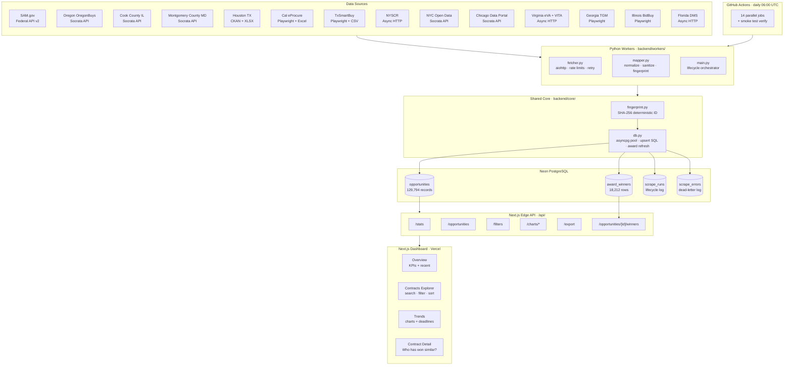

# Architecture Diagram

```mermaid
flowchart TD
    subgraph SOURCES["Data Sources"]
        direction TB
        S1["SAM.gov\nFederal API v2"]
        S2["Oregon OregonBuys\nSocrata API"]
        S3["Cook County IL\nSocrata API"]
        S4["Montgomery County MD\nSocrata API"]
        S5["Houston TX\nCKAN + XLSX"]
        S6["Cal eProcure\nPlaywright + Excel"]
        S7["TxSmartBuy\nPlaywright + CSV"]
        S8["NYSCR\nAsync HTTP"]
        S9["NYC Open Data\nSocrata API"]
        S10["Chicago Data Portal\nSocrata API"]
        S11["Virginia eVA + VITA\nAsync HTTP"]
        S12["Georgia TGM\nPlaywright"]
        S13["Illinois BidBuy\nPlaywright"]
        S14["Florida DMS\nAsync HTTP"]
    end

    subgraph WORKERS["Python Workers  ·  backend/workers/"]
        direction TB
        W1["fetcher.py\naiohttp · rate limits · retry"]
        W2["mapper.py\nnormalize · sanitize · fingerprint"]
        W3["main.py\nlifecycle orchestrator"]
    end

    subgraph CORE["Shared Core  ·  backend/core/"]
        FP["fingerprint.py\nSHA-256 deterministic ID"]
        DB["db.py\nasyncpg pool · upsert SQL · award refresh"]
    end

    subgraph PG["Neon PostgreSQL"]
        T1[("opportunities\n129,794 records")]
        T2[("award_winners\n18,212 rows")]
        T3[("scrape_runs\nlifecycle log")]
        T4[("scrape_errors\ndead-letter log")]
    end

    subgraph CRON["GitHub Actions  ·  daily 06:00 UTC"]
        GH["14 parallel jobs\n+ smoke test verify"]
    end

    subgraph API["Next.js Edge API  ·  /api/"]
        A1["/stats"]
        A2["/opportunities"]
        A3["/filters"]
        A4["/charts/*"]
        A5["/export"]
        A6["/opportunities/[id]/winners"]
    end

    subgraph UI["Next.js Dashboard  ·  Vercel"]
        U1["Overview\nKPIs + recent"]
        U2["Contracts Explorer\nsearch · filter · sort"]
        U3["Trends\ncharts + deadlines"]
        U4["Contract Detail\nWho has won similar?"]
    end

    SOURCES --> WORKERS
    WORKERS --> CORE
    FP --> DB
    DB --> T1
    DB --> T2
    DB --> T3
    DB --> T4
    CRON --> WORKERS
    T1 --> API
    T2 --> A6
    API --> UI
```
